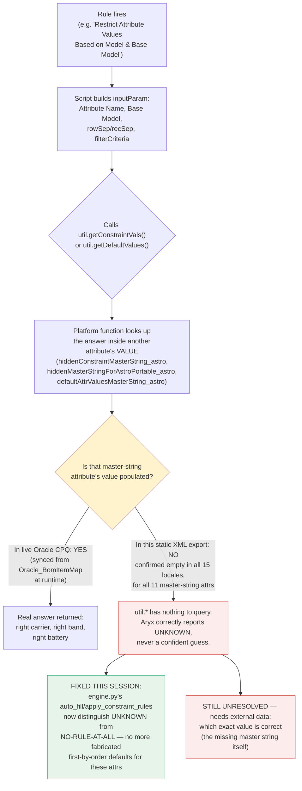

# One-Pager: Where the Carrier/Frequency-Band Resolution Breaks — Data, Not Code

**Full detail:** `docs/CPQ_CARRIER_WIRELESS_FREQBAND_DATA_GAP_PROOF_2026_08_07.md`. This is the condensed flow.

## The flow, and exactly where it breaks

## The three attributes, at a glance

| Attribute | Blocked by | Show/hide correct today? | Which-value correct today? |
|---|---|---|---|
| `carrierSelectionMultiSelect_astro` | `hiddenConstraintMasterString_astro`, `hiddenMasterStringForAstroPortable_astro` | No — needs same missing table | No |
| `wirelessCarrier_astro` | Same two tables + `defaultAttrValuesMasterString_astro` | No — same table | Partial (2 literal business-rule branches resolve without it) |
| `modelSelectionFrequencyBandMsl_astro` | `hiddenConstraintMasterString_astro` (which-value only) | **Yes** — proven for all 10 real product values | No |

## Why "read the XML harder" can't fix this

The rules are complete and correctly authored. What's missing is a **runtime database value**, not a catalog definition:

- Checked exhaustively: all 11 `*MasterString*`-named attributes are empty, in every language, everywhere in the 28MB file.
- Checked via real ingestion into Aryx (`workspace_id=36`, 714/714 rules and 430/430 attrs landed byte-for-byte correctly) — same empty result, confirmed by the system itself, not just manual reading.
- Checked for a structural workaround (attr-set groupings, rule-to-rule links) — none exist. The only place this data lives is inside a database table (`Oracle_BomItemMap`) synced by Oracle CPQ at quote time.

**Re-ingesting by catalog hierarchy (Product Family → Line → Model) doesn't help** — the missing attributes are `hidden=1`, runtime-populated, and absent at every hierarchy level, not merely scoped one level too low.

## What's fixable vs. not — the honest split

| | Fixable in Aryx code | Needs the missing master-string data |
|---|---|---|
| Two sibling attributes both getting filled with **contradicting** values | ✅ Fixed this session (`exclusive_sibling_family_exclusions`) | |
| An attribute getting a **confidently wrong default** when the real constraint is genuinely unknown | ✅ Fixed this session (`auto_fill`/`apply_constraint_rules` now distinguish "unknown" from "unconstrained") | |
| Which **specific value** is the correct one (right carrier, right band, right battery variant) | | ❌ Needs a live export of `hiddenConstraintMasterString_astro` / `hiddenMasterStringForAstroPortable_astro` / `defaultAttrValuesMasterString_astro` from the Oracle CPQ admin |
| Correct Base Model resolution | | ❌ Needs `Oracle_BomItemMap` (a live `bmql(...)` query in the real system, never exported statically) |

**Bottom line:** every code gap we could find and fix, we fixed. What's left over the line requires someone with access to the live Oracle CPQ catalog to pull three specific attribute values and one database table — no amount of additional engineering against this XML export can substitute for that.
