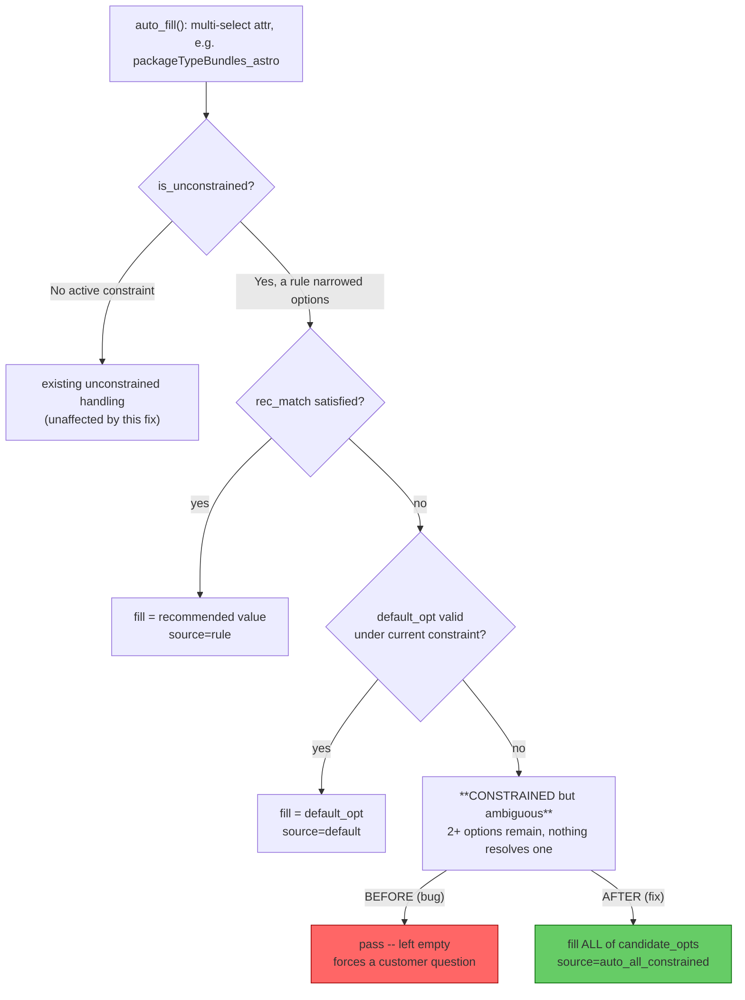
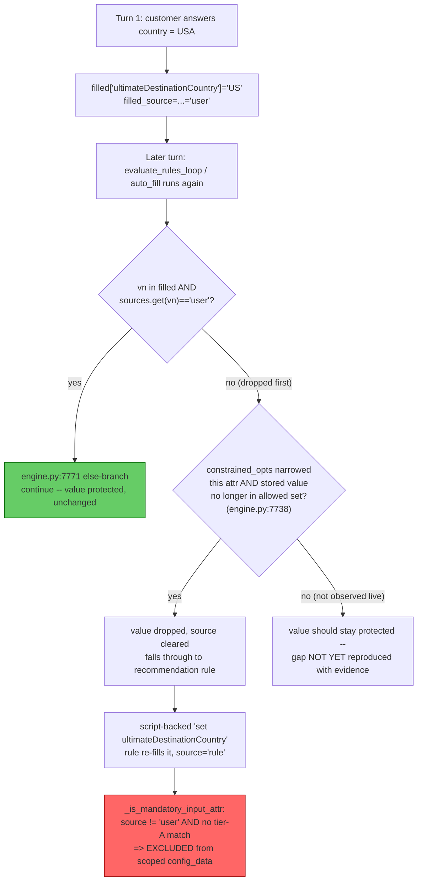
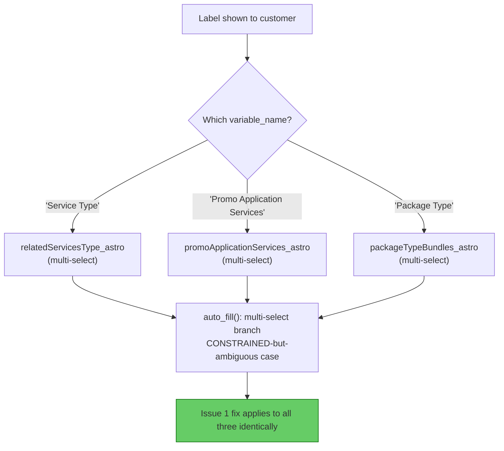
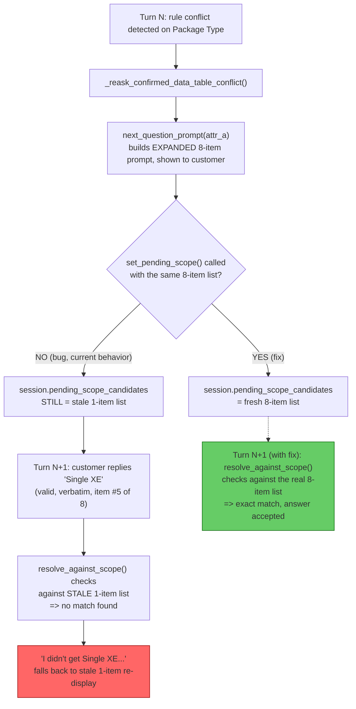

# CPQ: Multi-select auto-fill, country-in-config_data, and Package Type re-ask (2026-08-18)

## Reference: target `config_data` shape

This is the correct shape confirmed by the user — every attribute here is either a structural anchor
(country, hardware version, product) or a real resolved catalog value, no missing user-answered attrs:

```json
{
  "configData": {
    "ultimateDestinationCountry": {
      "value": "US",
      "displayValue": "United States"
    },
    "hWVersion_astro": {
      "value": "NEXT STANDARD LTE ONLY",
      "displayValue": "APX NEXT (4G LTE Only)"
    },
    "productSelectionProduct_all": {
      "value": "APX NEXT MULTI",
      "displayValue": "APX NEXT All Band"
    },
    "isProvisioningRequiredInCloudEnv_astro": {
      "value": "NO",
      "displayValue": "No"
    },
    "wirelessCarrier_astro": {
      "value": "ATT/FIRSTNET",
      "displayValue": "ATT/FirstNet (provided by Motorola)"
    }
  }
}
```

Every issue below is judged against this bar: does the attribute reach `build_payload`'s output in this
exact `{value, displayValue}` shape, with the right value, without being asked when it shouldn't be.

---

## Issue 1 — Multi-select attrs stuck unresolved (`packageTypeBundles_astro`)

### Problem statement
A multi-select attribute that a real, active catalog rule has narrowed to 2+ legal options (not fully
unconstrained, not resolved to exactly one by any recommendation/default) was left completely empty by
`auto_fill()` — never filled, but also not asked in some code paths — instead of being resolved to a
value the customer could see in `config_data`.

### Root cause
`src/aryx/cpq/engine.py`, `auto_fill()`, multi-select "CONSTRAINED but ambiguous" sub-branch (line
~8687, `is_unconstrained=False`, no `rec_match`, no `default_opt`). The branch body was a bare `pass` —
by explicit prior design (a documented HITL decision: "picking N-of-11 options is exactly as arbitrary
as picking one, so don't guess").

### Classification: **code bug** (by explicit 2026-08-18 policy change, not a data gap)
The catalog data and rules are working exactly as ingested — a real constraint rule *is* narrowing the
option set correctly. The gap is a **product decision embedded in code**: the engine chose to leave the
attr blank rather than resolve it. This is not missing/bad data; it is a deliberate (now overridden)
code policy.

### Fix
Changed the `pass` to: select **all** options in `candidate_opts` (already filtered to the rule's
`current_allowed` set). Tagged `sources.setdefault(vn, "auto_all_constrained")` + an INFO log line.
Applied and syntax-verified; **not yet deployed/tested live**.



---

## Issue 2 — `ultimateDestinationCountry` missing from scoped `config_data`

### Problem statement
Per the target payload above, `ultimateDestinationCountry` must always appear when the customer answered
it directly (turn 1: "USA"). In observed transcripts it sometimes does not survive into later turns'
`config_data`.

### Root cause — **not fully confirmed**, two candidate mechanisms traced
1. **Constraint invalidation + rule reassert (code path exists, not proven live):** if
   `constrained_opts` narrows this attr's allowed set and the customer's stored value falls outside it
   (`engine.py:7738`), the value is dropped and the recurring script-backed recommendation rule
   (`'Recommendation rule to set ultimateDestinationCountry'`, confirmed firing every turn in live logs)
   re-fills it with `source="rule"` — silently losing the `source="user"` tag that
   `_is_mandatory_input_attr` needs to keep it in scoped `config_data`.
2. **Hiding rule (no live evidence found):** `build_payload`'s `hidden_vns` exclusion is unconditional
   ("even if present in filled") — checked, no hiding-rule log line ever named this attr in the sampled
   window.

Neither mechanism was caught actually firing on this attribute in the 24h log sample. `_is_noise_var`
was ruled out (returns `False` for this name).

### Classification: **likely code bug, not confirmed** — leaning toward mechanism (1), a code-level
provenance-tracking gap, not missing catalog data (the recommendation rule and the customer's answer
both exist and are both real).

### Fix — not yet applied, blocked on confirmation
Add a temporary DEBUG log of `filled_source.get("ultimateDestinationCountry")` and
`constrained_opts.get(<its entity_id>)` immediately before `build_payload` runs, then reproduce live to
catch the exact turn where `source` flips away from `"user"`.



---

## Issue 3 — "Service Type" / "Promo Application Services" asking despite the single-select fix

### Problem statement
Live transcript (2026-08-18) shows both being asked as single-answer-looking prompts even after an
earlier fix removed the blind-fill blocker from `auto_fill()`'s **single-select** branches.

### Root cause
Both are confirmed **multi-select** attrs, not single-select:
- **"Service Type"** → `relatedServicesType_astro` (options match
  `docs/CPQ_APX_NEXT_RULE_CATALOG.md:958`).
- **"Promo Application Services"** → `promoApplicationServices_astro` (options match the `"~"`-split
  script at `docs/CPQ_APX_NEXT_RULE_CATALOG.md:1003`).

The earlier single-select fix is in a structurally different branch of `auto_fill()` and cannot reach
these — they land in the exact same "CONSTRAINED but ambiguous" multi-select branch fixed under Issue 1.

### Classification: **code bug** — same root cause and same fix as Issue 1, not a separate defect and
not a data gap.

### Fix
No separate change needed — covered by Issue 1's fix. Needs deploy + live re-test to confirm both stop
being asked.



---

## Issue 4 — Package Type re-ask rejects the customer's own verbatim answer

### Problem statement
After a rule conflict expands Package Type's option list from 1 item to 8, the customer replies with an
exact, verbatim option from the new 8-item list ("Single XE", #5). The system rejects it as "no match"
and falls back to re-offering the **stale original 1-item list**.

### Root cause
`src/aryx/api/ask_api.py`, `_reask_confirmed_data_table_conflict()` (~line 1710-1757): builds the
expanded prompt via `_cpq_engine.next_question_prompt(attr_a)` but **never calls
`set_pending_scope(...)`**. `session.pending_scope_candidates` — the list the next reply is actually
validated against — still holds the prior turn's narrow 1-item list. The customer's answer is validated
against the wrong, stale candidate set.

### Classification: **code bug** — a missing call at one specific call site; the pattern
(`set_pending_scope` after building an expanded prompt) already exists and is used correctly elsewhere
in the same file. Not a data or catalog-rule issue — the 8-item list itself was built correctly and
shown correctly; only the validation-side state was never updated to match.

### Fix — applied
In `_reask_confirmed_data_table_conflict()` (`src/aryx/api/ask_api.py`), added a
`set_pending_scope(session, kind="attr_options", candidates=[o.display_name for o in attr_a.options],
origin_question=prompt, attr_vn=attr_a_vn, asked_turn=session.turn)` call immediately after `prompt` is
built, before returning it. Syntax-verified (`ast.parse`); **not yet deployed/tested live**.

Note: candidates use the attr's full `attr_a.options` list (not narrowed to `_presentable`-filtered
`effective_opts` like `next_question_prompt` itself uses internally, since that helper is private to
`engine.py`) — a harmless superset; it can only ever make matching more permissive, never reject a
value that's genuinely on the list shown to the customer.

`_reask_stale_constraint_violations` (the sibling "Before finishing — X is no longer valid" re-ask a
few hundred lines above this one, `ask_api.py:1878`) has the **same missing-scope-sync gap** — not
fixed here, out of scope for this issue, flagged for a follow-up.



---

## Summary table

| # | Issue | Classification | Status |
|---|-------|-----------------|--------|
| 1 | Multi-select CONSTRAINED-ambiguous left empty (`packageTypeBundles_astro`) | Code bug (policy override) | Fixed, not deployed |
| 2 | `ultimateDestinationCountry` dropped from scoped config_data | Code bug (unconfirmed mechanism) | Traced, not fixed |
| 3 | Service Type / Promo Application Services still asking | Code bug — same root cause as #1 | Covered by #1's fix |
| 4 | Package Type re-ask rejects verbatim answer | Code bug — missing `set_pending_scope` call | Fixed, not deployed |
