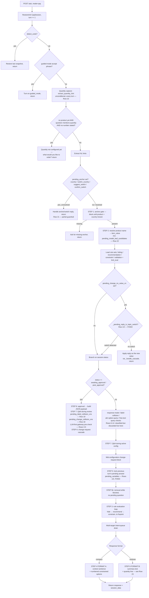

# CPQ Ask-Flow: Regex-Deterministic Detectors vs. LLM Anchor + Guardrails — Audit 2026-08-12

## Summary

**What this is about:** when a customer types something in the
configurator chat, the system has to figure out what they mean —
"change the color to red," "remove that option," "yes, submit it," "show
me the JSON," and so on. There are two ways it currently figures that
out: **pattern-matching** (fast, cheap, but only recognizes phrasing it
was specifically built to expect) and an **AI classifier** (understands
more natural, varied phrasing, but every AI answer is double-checked
against the real catalog before anything is acted on, so it can never
invent a product, option, or value that doesn't exist).

This audit found 12 places where the system was still relying only on
pattern-matching, meaning an unusual way of phrasing a request could go
unrecognized. Over this project, most of those were fixed so the AI
classifier now backs up the pattern-matching — always double-checked,
never trusted blindly.

**What actually changed, in plain terms:**

- **Confirming an order ("yes, that's everything, submit it")** — now
  understood even when phrased unusually, not just exact words like
  "confirm." The same safety check that verifies the order is valid
  before submitting still runs every time, unchanged.
- **Asking a question about the configuration** — now recognized even
  when the AI has to consult the underlying product documentation to
  answer, not just when phrased as an obvious question.
- **Removing one option from a multi-choice selection, turning an
  optional feature on, or clearing a value back to blank** — all now
  understood from more natural phrasing, with checks in place so the
  system never removes/adds/clears something that wasn't actually
  selected, isn't actually optional, or would immediately get filled
  back in by another rule (which would make the action pointless and
  confusing).
- **"Change the quantity for both/all of these to 67"** — a bulk
  quantity update — now understood from natural phrasing, restricted so
  it only ever updates rows the customer actually has selected, never a
  lookalike field that happens to share the same on-screen label.
- **"Show me the underlying JSON data"** — now understood from more
  varied phrasing while reviewing a finished configuration, not just
  the obvious "show me the json."
- **Declining a proposed change** ("no, leave it as is," "actually,
  never mind") — now recognized more reliably, with a safeguard added
  mid-way through this work after testing caught it initially being
  too eager (see the "regression caught" note further down) — it now
  only ever asks the AI when the message already sounds decline-shaped,
  so it doesn't slow down or second-guess ordinary answers.
- **A confusing or unusual reply to "did you mean to switch products?"
  or a quantity typed as words instead of digits** — both now have an
  AI fallback so the system can still figure out what was meant instead
  of getting stuck.
- **A rare case where negating an attribute's only real option could
  wrongly hide the whole thing** — fixed with a small, purely mechanical
  rule change (no AI involved), so this one is a plain bug fix rather
  than a phrasing-understanding improvement.
- **Two things investigated and found to already work correctly** —
  a "did you mean one of these numbered options?" fallback, and how the
  system resolves disagreements between the two detection methods.
  Both were already handled properly by existing code; nothing needed
  to be built, so the audit was corrected instead of adding a duplicate
  mechanism.

**Still open, deliberately not done yet:** recognizing when a customer
mentions a *different product* mid-conversation (e.g. "actually I meant
the XE model") through the AI classifier is a bigger piece of work than
everything above — it requires teaching the AI classifier what products
exist in the catalog in the first place, which nothing above needed.
That's written up as a design sketch, not built, pending a decision on
whether it's worth doing now. One older cosmetic item (a phrasing nuance
around stating an assumption) was also deliberately left alone — low
value, not worth the engineering cost.

**Safety net throughout:** every change above was covered by new
automated tests, and the full existing test suite (997 tests) was run
after every single change with zero failures. Nothing was shipped
without the system rebuilt, redeployed, and re-verified as healthy.

## Three problem statements

### Problem 1 — the AI was being asked, then ignored

Behind the scenes, every customer message was already being shown to
an AI model that tried to classify what the customer meant — "this is
a request to remove an option," "this is a question," "this is an
approval," and so on. That classification happened. It just wasn't
*used*. The system asked the AI, got an answer back, logged it for
engineers to look at later — and then went and made its actual
decision using only the older pattern-matching method, as if the AI
had never been asked at all.

Think of it like having a bilingual translator standing in the room
who correctly translates what a customer said, but the person running
the counter ignores the translator and just goes with their own guess.
Most of the time the guess is fine, because most customers phrase
things the expected way. But when a customer phrases something
unusually, the translator had the right answer the whole time — and
it was thrown away. This audit's core job was finding every place this
was happening and switching the system to actually use the answer it
already had, once it was safe to do so.

**Root cause:** the AI's answer, once produced, has to pass through a
single checkpoint that decides what to actually do with it. That
checkpoint only recognized **5 out of 14** possible kinds of answer it
could be handed. For the other 9 kinds — including things like "remove
this option," "turn on this feature," "approve the order," "answer
this question," and "update this quantity" — the checkpoint simply
didn't know what to do, so it shrugged and told the rest of the system
"ignore this, fall back to the old method." Nothing was broken and the
AI wasn't wrong — the part of the system responsible for listening to
the AI's answer had just never been taught to recognize those 9 answer
types. Two of those 9 (turning a feature on, and clearing a value) had
a second, separate version of the same issue one step earlier: even
before reaching that checkpoint, an internal cross-check that's
supposed to double-confirm the AI's answer had never been built to
look at those two cases at all — so even fixing the checkpoint
wouldn't have been enough on its own for those two without also fixing
that earlier step.

### Problem 2 — what a "guardrail" is, and why it's not optional

An AI model can be wrong in a specific, dangerous way: it can sound
completely confident while inventing something that doesn't exist — a
product that isn't in the catalog, an option that was never offered, a
value nobody selected. A guardrail is the second check that catches
this before it ever reaches the customer or the final order. It's the
difference between "the AI said X" and "the AI said X, and X is
verified to be a real, currently-valid choice for this customer's
configuration."

Every single AI-driven decision in this system goes through a
guardrail before it's allowed to change anything. If the guardrail
can't verify the AI's answer against the real, current list of valid
options, the system does not guess — it either falls back to the
older pattern-matching method, or it stops and asks the customer a
clarifying question. This is why turning on more AI-assisted
understanding (Problem 1) was safe to do: the guardrail was already
required as a precondition for every single change made in this audit,
never an afterthought bolted on later.

**Root cause:** an AI doesn't look answers up in a list of facts — it
generates text that sounds right based on patterns it learned, which
means it can produce something that sounds exactly like a real product
or option without that thing actually existing, especially when a
customer's wording is unusual. This isn't the AI malfunctioning; it's
simply what this kind of technology does by nature, which is why its
raw answer can never be trusted on its own. The fix built into this
system is a second, independent check that only allows the AI to point
at something from the real, current, up-to-date list of valid choices —
it is never allowed to just write out a name of its own choosing. If
that check can't confirm the AI's pick is real and genuinely present in
what the customer typed, or if the AI itself reports low confidence,
the system automatically backs off to asking the customer a clarifying
question instead of guessing. This check runs before any of the 24
touch points in Problem 3 are allowed to use an AI-classified answer at
all.

### Problem 3 — the 24 "decision touch points" audited

Every time the system has to decide what a customer meant, that's one
"decision touch point." This audit went through the entire
customer-chat flow and found **24 distinct places** where such a
decision gets made — everything from "is this an approval?" to "is
this a request to remove a selected option?" to "did the customer just
mention a different product?"

For each of the 24, this audit asked two plain questions: *does the AI
get a chance to help here, or is it pattern-matching only?* and
*if the AI does help, is there a guardrail catching a wrong answer
before it reaches the customer?* Out of 24, most were found to be
AI-assisted-but-ignored (Problem 1) or pattern-matching-only with no AI
backup at all. This audit closed the large majority of those gaps,
verified two were already safely handled by existing code, and left
one (recognizing a different product mid-conversation) as a documented,
scoped-but-not-built design decision for a future session.

**Root cause:** the chat system wasn't built all at once with AI in
mind from day one. It started as a growing collection of individual
pattern-matching rules, each one added whenever a new kind of phrasing
tripped the system up in real use. The AI classifier and its
guardrail were introduced later, as a layer placed on top of that
existing patchwork rather than a full rebuild — and it was turned on
for one type of request at a time rather than all at once. That's
exactly why the 24 spots ended up in different states: a handful were
AI-backed from the very start, most had the AI quietly ignored
(Problem 1), and one case (recognizing a different product
mid-conversation) needs a bigger change first, because the AI has
never even been shown the list of real products that exist — only the
details of the one product already being configured — so it has
nothing to pick a product from yet, even if asked to. It also matters
where in the conversation this all happens: the one place that
currently listens to the AI's answer only runs while the customer is
reviewing a finished configuration, right before confirming it — so
even a fully fixed spot has no effect earlier in the conversation. A
few of the 24 (like asking for a batch of questions at once) fall into
that earlier stage on purpose, not by oversight.

## Why this audit

This session found two live bugs from the exact same root cause: a
regex-only gate deciding something important (is this a redirect? is
this an answer?) with no LLM fallback for phrasing the regex didn't
anticipate — `_pending_reply_looks_like_new_request` and
`session.pending_change_no_value_vn`'s consumer. Both are now fixed
(docs/CPQ_PENDING_TOPIC_SWITCH_PLAN_2026_08_11.md). This audit
generalizes the question: **where else in the ask/CPQ flow does the
same shape of risk exist** — regex-first, no LLM anchor, or an LLM
anchor with no guardrail against hallucination?

## Full ask-turn flow (`_run_cpq_turn_inner`, ask_api.py)

Every `/ask` request in CPQ mode runs through one function, top to
bottom, with early returns at almost every gate — the first gate that
matches wins and short-circuits everything below it. This is the real
execution order (not file line order — some gates repeat at different
points for different reasons), so the table above can be read in
context: which pending mechanism each regex/LLM check actually guards,
and how early or late in the turn it runs.



### Flow stops, in real execution order — with the actual function and a live example

| Order | Gate | Function(s) | Concrete example → outcome | Pending field | Row(s) |
|---|---|---|---|---|---|
| 1 | Session restore + turn increment | `CpqSession.from_dict`, `_mine_history_for_cpq_context` | Client resends `session_data` from the previous response; `turn` goes 4→5 | — | — |
| 2 | `detect_undo` | `detect_undo` / `restore_last_snapshot` | "undo that" → last `push_snapshot()` state restored, turn's other logic never runs | — | — |
| 3 | Guided-mode accept | `detect_guided_mode_accept` | "just ask me one thing at a time" → `session.guided_mode = True`, gateway never called again this session | — | — |
| 4 | Quantity capture | `extract_quantity_hint` | "...50 in qty..." → regex `(-?\d+)\s*(?i:in\s+)?qty` matches → `session.product_quantity = 50`, silently, every turn | `product_quantity` | 23 |
| 5 | Quantity-before-any-quote | `question_mentions_quantity` + `quantity_turn_precheck` | "what is my quantity?" with no product yet → "Quantity is not configured yet... what would you like to order?", return | — | 23 |
| 6 | NL hint extraction | `extract_hints`, `extract_catalog_hints`, `extract_flag_hints` | "Houston, Texas, destination US" → `{country: "United States"}` etc. added to `hints` dict | — | — |
| 7 | `pending_anchor` (country/switch) | inline block, `_country_available_for`, `_complete_product_switch` | Prior turn offered "switch to videoSolutions_BOM?"; "no" → `pending_switch_product` cleared, "OK — continuing with X" | `pending_anchor`, `pending_switch_product` | 21 |
| 8 | STEP 1 — anchor gate | inline, checks `session.product_name` / `session.country` | Neither set yet → "Product — choose one: ..." numbered list, return | — | — |
| 9 | STEP 2 — product resolution | `_cpq_engine.load_product_config`, model-leaf disambiguation block | "APX NEXT All Band" → resolved to the real `aPXNext_BOM` leaf id via `resolve_against_scope` then `_llm_resolve_label_collision` on a miss | `pending_model_leaf_candidates` | 22 |
| 10 | Load rule sets | `load_hiding_rules`, `load_recommendation_and_constraint_rules`, `load_validation_rules`, `build_bml_evaluator` | Pure catalog reads for this workspace/product — no branching | — | — |
| 11 | `pending_change_no_value_vn` | `_pending_reply_is_topic_switch` then `apply_answer`/`_handle_cascade` | "First i wanted to changed Wireless Carrier" while Hardware Version pending → LLM identifies `carrierSelection_astro`, falls through instead of forcing a failed match | same field | 1, 2 (fixed) |
| 12 | Status branch: awaiting/post-approval | STEP 8/7/6 handlers, `_llm_resolve_label_collision`, `intent_gateway.classify_intent` | "confirm" while `status="awaiting_approval"` → STEP 8 builds the real JSON payload | `pending_label_collision_vns`, `pending_change_collision_vns` | 3-5, 18, 19 |
| 13 | Response-mode / label-collision / attr-query / free-text-query | `detect_response_mode_request`, `detect_label_collision`, `detect_attr_query` | "what are the options for mount type?" → options list shown; **this is where an already-classified `ATTR_QUERY`/`QA_QUESTION` result would be used, if dispatch were wired (rows 6-14)** | — | 6-14 |
| 14 | STEP 7 — active-config Q&A | `detect_qa_question(strict=True)`, `_handle_cpq_qa` | "why does hardware version matter?" mid-config → graph-grounded answer, config state untouched | — | 11 |
| 15 | Mid-configuration change request | `detect_change_request`, `_handle_cascade` | "change hardware version to 4G LTE Only" after config already has a value → cascade invalidates dependents, re-asks | — | 3-5 |
| 16 | STEP 5 — lock pending answer | `_pending_reply_is_topic_switch`, `apply_answer` | "APX NEXT (4G LTE Only)" answering a pending Hardware Version prompt → `session.filled["hWVersion_astro"] = ...` | `pending_variables` | 1, 2 (fixed) |
| 17 | STEP 5b — blocked removal | inline, checks `filled_multi` | A multi-select decline mid-block ("no mounts needed") while nothing else pending | — | 6 |
| 18 | STEP 3 — rule evaluation loop | `evaluate_rules_loop` (hide → recommend → constrain, to fixpoint) | Setting Hardware Version hides/reveals Carrier Selection options per `HidingRule`s | — | — |
| 19 | Multi-target queue drain | `session.pending_intent_queue` | "change hardware version and carrier selection" → asks Hardware Version first, Carrier Selection queued next | `pending_intent_queue` | — |
| 20 | STEP 6/4 — response formatting | `_cpq_summary_text` (verbose) or numbered-options block (compact) | "Configuration complete" summary, now including the `**Quantity:** 50` line | — | 23 |

## Why not just one LLM configured to handle all of this?

There already **is** one general-purpose classifier that runs once per
turn — `intent_gateway.classify_intent` (Row 3-14's gateway) — with the
strongest guardrails in the codebase: it can only pick from attribute
candidates actually injected into its prompt, its evidence span must
be a verbatim substring of the user's own message, and it already
receives `SESSION PENDING: pending_attr=..., awaiting_value_for=...`
context in every prompt, so it is **already pending-state aware in
principle**.

The honest answer has two parts — one structural, one operational (and
the operational one is the more important finding here).

### Part 1 — structural reasons a single schema can't cover everything

| Reason | Example | Why one shared schema can't absorb it |
|---|---|---|
| **The concept isn't a catalog attribute** | Session-level product quantity ("how many radios total") | The gateway's `variable_name` field is validated against real `ConfigAttr` ids injected from the catalog. "The whole order's quantity" has no such id — teaching the schema to also emit non-catalog session concepts would mean validating a second, parallel universe of fields inside the same quarantine logic. |
| **The ambiguity can only be discovered after a resolution attempt fails** | Two real attrs share a display label ("Mounting Type" appears on both a single-select and a multi-select attr) | `intent_schema.py`'s own design note says this explicitly: label collision is a property of the *deterministic resolution layer*, not something knowable from the raw message upfront. It's inherently two-stage: classify → attempt resolve → disambiguate only on failure. |
| **The question is deliberately narrower than "classify this message"** | "Does this redirect name a DIFFERENT specific attribute than the one currently pending?" | A yes/no/which-of-these-N question has a far smaller answer space than "pick 1 of 12 categories across the whole catalog." Smaller answer space is empirically more reliable — this is the same reasoning already written into `_llm_resolve_quantity_target`'s docstring this session: "cramming a narrow judgment call into general-purpose machinery would be a worse fit than a dedicated helper." |

### Part 2 — the more important finding: the gateway already tries to be that one LLM, and its answer is thrown away for most categories

Per this audit's own table (rows 6-14), `_dispatch_intent_result`
computes a confident, guardrailed classification for **9 of 12**
categories every single turn and then explicitly discards it — its own
docstring calls this "deliberately deferred rather than rushed." Two
of those nine are `ATTR_QUERY` and `QA_QUESTION` — which is *exactly*
the shape of "customer wants to talk about/ask about a different
attribute" that the new `_llm_detect_pending_topic_switch` helper
(Row 1/2) was built to catch. The gateway likely already classifies
"I wanted to check the carrier selection value" as `ATTR_QUERY` on
`carrierSelection_astro` correctly, in the same call — but that result
is never used, because `_dispatch_intent_result` returns `None` for
`ATTR_QUERY` unconditionally.

**So the honest count is: not "12 different LLM anchors were needed,"
but "1 general anchor exists, ~6 narrow anchors were added for cases
the general one structurally can't express, and a 7th class of bug
(this week's) was fixed with a narrow anchor that likely duplicates
a capability the general one already has but doesn't act on."**

### The exact 12-category breakdown: wired vs. not wired

The gateway (`IntentCategory` in `intent_schema.py`) classifies every
one of these 12 categories on every turn it runs. `_dispatch_intent_result`
only *acts on* 5 of them — the other 9 are computed and discarded, so
pure regex is still the actual decision-maker for those today.

| # | Category | Wired to a handler? | What decides it today |
|---|---|---|---|
| 1 | `CHANGE_REQUEST` | ✅ Wired | LLM result used (`_handle_cascade`), agreement with `detect_change_request` required |
| 2 | `CHANGE_REQUESTS_MULTI` | ✅ Wired | LLM result used (`_handle_cascade_multi`), agreement required |
| 3 | `CHANGE_TARGET_WITHOUT_VALUE` | ✅ Wired | LLM result used (`_build_no_value_response`), agreement required |
| 4 | `AMBIGUOUS` | ✅ Wired | LLM's own `clarifying_question` answered directly — no mutation risk |
| 5 | `OUT_OF_SCOPE` | ✅ Wired | Same refusal wording as `_llm_classify_is_cpq_question`'s negative case |
| 6 | `MULTI_SELECT_REMOVAL` | ❌ Not wired | Pure regex — `_REMOVE_VERB_RE` / `detect_multi_select_removal` |
| 7 | `ATTR_ACTIVATION` | ❌ Not wired | Pure regex — `_ADD_VERB_RE` / `detect_attr_activation` |
| 8 | `ATTR_CLEAR` | ❌ Not wired | Pure regex — `_CLEAR_VERB_RE` / `detect_attr_clear` |
| 9 | `BULK_QUANTITY_CHANGE` | ❌ Not wired | Pure regex — `_BULK_QTY_RE` / `detect_bulk_quantity_change` |
| 10 | `APPROVAL` | ❌ Not wired | Pure regex — `_APPROVAL_RE` / `detect_approval` |
| 11 | `QA_QUESTION` | ❌ Not wired | Pure regex — `_QA_INTENT_RE` / `detect_qa_question` |
| 12 | `ATTR_QUERY` | ❌ Not wired | Pure regex — `detect_attr_query` |
| — | `PRODUCT_MENTION` | ❌ Not wired | Fuzzy/regex — `detect_product_mention` (also part of the schema, listed separately from the 12 "mirrors one regex detector" set since it's used differently) |
| — | `RESPONSE_MODE_REQUEST` | ❌ Not wired | Pure regex — `detect_response_mode_request` |
| — | `UNDO` | N/A | Handled before the gateway even runs — first-class undo check at the very top of the turn, not part of this classify/dispatch split at all |

**Split of the 9 not-wired categories by risk, for sequencing:**
- **Read-only / routing (low risk to wire):** `APPROVAL`, `QA_QUESTION`, `ATTR_QUERY`, `PRODUCT_MENTION`, `RESPONSE_MODE_REQUEST`
- **State-mutating (needs the same agreement guard as the 5 already wired):** `MULTI_SELECT_REMOVAL`, `ATTR_ACTIVATION`, `ATTR_CLEAR`, `BULK_QUANTITY_CHANGE`

### Purpose of regex in this codebase — and why it genuinely can't handle complex requests

Regex is not here to be "the intelligence" — it's here for three
narrower jobs, all still valuable even in an LLM-first design:

| Job | Why it matters | Where it shows up |
|---|---|---|
| Zero-latency, zero-cost triage | Most turns are trivially unambiguous (a bare "yes", a numbered pick, an exact catalog string) — round-tripping every one through an LLM adds real latency and token cost for no benefit | Every narrow LLM helper this session is gated *behind* a deterministic check that runs first and short-circuits on a match |
| Determinism / testability | A regex match is 100% reproducible in CI, no network mocking, no drift across model versions | Every regex detector has direct unit tests with zero LLM involvement |
| Final-mile grounding | Even after an LLM correctly identifies intent, something still has to match the free text against the *real* catalog option string | `apply_answer`/`apply_multi_answer` run after every LLM-driven path — the LLM's job is intent, never ground truth |

What regex **cannot** do is handle compositional, multi-clause, or
unusually-phrased requests — a fixed keyword list has no way to
generalize to phrasing its author didn't anticipate. That's the exact
shape of both bugs fixed this week ("I don't want hardware version but
carrier selection" matches none of `_CHANGE_VERB_RE`'s enumerated verb
forms). This codebase's own trajectory already agrees: the gateway is
a single LLM call per turn built specifically because regex couldn't
scale to real conversational phrasing for the 5 categories it now
owns. The right next step is finishing that migration for the other 9
categories, not building a second, separate "one LLM for everything"
from scratch — that would duplicate a system that already works for
nearly half the categories and already has its guardrails proven in
production.

### Why not remove regex entirely, even for the 5 already-wired categories

Because the gateway's own design is "LLM decides, regex confirms" for
mutating changes on purpose — `MUTATING_CATEGORIES` requires the LLM
and the deterministic detector to *agree* before a change is trusted.
Dropping that agreement check removes the only thing stopping a
hallucinated attribute from mutating a customer's real configuration
with no second opinion. Separately, the gateway already caps what it
shows the model per call (`_ATTR_CAP = 60` attributes, `_VALUE_CAP = 40`
options) — a true "one call sees the entire catalog" design doesn't
scale past a certain size without candidate pruning, which is itself a
deterministic (non-LLM) step run before the LLM call.

### What this means for the "why so many" question

- **Legitimate, keep separate:** quantity-target resolution, label/change-target collision, model-leaf disambiguation, clarify-reply resolution — these plug real, permanent structural gaps in the general schema (Part 1 above).
- **Possibly redundant, worth re-examining:** `_llm_detect_pending_topic_switch` (this week's fix). If `ATTR_QUERY`/`QA_QUESTION` dispatch had already been wired (this audit's own Priority 1/2 recommendation), the pending-answer redirect bug may never have needed its own bespoke helper — the general gateway would likely have caught it for free, since it already has the pending-state context and already classifies the message correctly today, just doesn't act on it.
- **Practical recommendation:** finish wiring the 9 discarded categories (the audit's existing priority order) *before* adding further narrow one-off helpers for new bugs. Each new narrow helper that duplicates an already-classified-but-discarded category is technical debt accumulating in the same place the fix already exists — it just isn't switched on.

## The guardrail patterns in this codebase (reference)

**Status note (2026-08-12):** originally this section catalogued only
2 patterns, because the audit that produced it was scoped narrowly to
one question — *is the LLM being honest?* — triggered by the two
topic-switch bugs. It described what already existed for that
specific problem, not a claim that those 2 were a complete guardrail
set. PR #186's regex bugs exposed a second class of failure (deterministic
code being wrong on its own terms) neither pattern was ever designed to
catch. **4 more guardrails (#3-#6) are now adopted** — see "Guardrail
taxonomy" further below for the full rationale and evidence behind
each. The two below remain the ones the **Inventory** table's own
"Guardrails?" column measures per detector (#1/#2 are wired
row-by-row); #3-#6 apply orthogonally across the whole surface as a
testing/verification practice, not as a per-row wiring choice, so they
aren't re-scored into the Inventory table itself.

### #1-#2 — detector-level (existing, measured in the Inventory table below)

1. **Gateway quarantine** (`intent_gateway.py`, the universal LLM-first
   classifier): variable_name must be in the injected candidate set,
   value_ref must be in-range, evidence_span must appear verbatim in
   the question, LOW confidence always falls through, mutating
   categories require agreement with the deterministic detector, 1
   schema retry then fallback. This is the strongest pattern in the
   codebase.
2. **Narrow single-purpose LLM helper** (`_llm_classify_intent_core`
   skeleton — `_llm_resolve_label_collision`,
   `_llm_resolve_quantity_target`, `_llm_detect_pending_topic_switch`,
   `_match_pending_clarify_reply`'s LLM tier): a small, scoped prompt
   with an explicit candidate allow-list; a `_validate` callback that
   rejects any answer not in that allow-list; returns `None` on
   call/parse failure. Weaker than the gateway (no evidence-span check,
   no retry), but scoped narrowly enough that hallucination has nowhere
   to land — the invented-name-rejection is still there.

Any detector below is "guardrailed" (in the Inventory table's own
sense) only if it has one of these two shapes wired in — not just "an
LLM gets called somewhere nearby."

### #3-#6 — system-level (newly adopted, applied across the whole surface)

3. **Adversarial / property-based regex testing** — systematically
   generated edge cases (glued digits, separators, decimals, sign
   characters) per pattern, not just hand-picked examples. Applied as
   one consolidated pass after the master implementation plan's Phases
   1-4 and the 9 open items are built (see that plan's verification
   section for the exact sequencing and the trade-off it accepts).
4. **Contract / drift tests** — assert code actually does what its own
   docstring claims (the check that would have caught
   `_gateway_to_intent_result`'s `needs_target` drift from
   `IntentResult`'s own documented contract). Same consolidated-pass
   timing as #3.
5. **Plausibility cross-check** — flag a value that suspiciously
   matches something already present elsewhere in session state (e.g.
   a quantity equal to a digit run inside a model code just selected).
   **Not yet adopted** — remains a distinct future design proposal, not
   scheduled into the current plan.
6. **Regression-locking on the exact reported phrasing** — every
   live-reported bug gets a permanent test tied to the customer's real
   sentence, applied both during implementation (where a real incident
   already exists) and retroactively in the final consolidated pass.

## Inventory

| # | Component (regex) | What it decides | Where it lives | LLM anchor? | Guardrails? | Gap / Risk |
|---|---|---|---|---|---|---|
| 1 | `_CHANGE_VERB_RE` / `_ARROW_RE` — pending-answer redirect (`_pending_reply_looks_like_new_request`) | Is a reply to a pending single-select actually about a *different* attribute? | ask_api.py | **Yes** (fixed 2026-08-11) — `_llm_detect_pending_topic_switch`, narrow-helper pattern | **Yes** — candidate allow-list, fails safe to "not a switch" | Closed |
| 2 | Same regex, on `session.pending_change_no_value_vn`'s "which value?" flow | Same question, different pending mechanism | ask_api.py | **Yes** (fixed 2026-08-11) — same helper reused | **Yes** | Closed |
| 3 | `detect_change_request` / `_change_request_matches` | Change-verb + value → (attr, value) pair | engine.py | **Partial** — covered by gateway's `CHANGE_REQUEST` category, but only when `cpq_llm_first_enabled` and confidence isn't LOW | **Yes** (gateway quarantine) when it fires | With the flag off, or LOW confidence, or gateway-deterministic disagreement → pure regex, zero anchor |
| 4 | `detect_change_target_without_value` | Change-verb naming an attr, no value | engine.py | **Yes** — gateway's `CHANGE_TARGET_WITHOUT_VALUE` dispatches to the same handler | **Yes** (gateway quarantine) | Same flag/confidence caveat as #3 |
| 5 | `detect_change_requests_multi` | Multiple change targets in one message | engine.py | **Yes** — gateway's `CHANGE_REQUESTS_MULTI` | **Yes** | Same caveat |
| 6 | `_REMOVE_VERB_RE` (`detect_multi_select_removal`) | Deselect a multi-select option | engine.py | **Classified, not dispatched** — `IntentCategory.MULTI_SELECT_REMOVAL` exists in the schema and the LLM labels it, but `_dispatch_intent_result` explicitly returns `None` for this category (docstring: "deliberately deferred") | **No** — the classification is thrown away | **Gap.** The LLM already sees this correctly in many cases; the result is computed and discarded every time. Purely regex in practice today. |
| 7 | `_ADD_VERB_RE` (`detect_attr_activation`) | Turn on/select an optional attr | engine.py | **Classified, not dispatched** (`ATTR_ACTIVATION`) | **No** | Same gap as #6 |
| 8 | `_CLEAR_VERB_RE` (`detect_attr_clear`) | Explicitly clear/blank a value | engine.py | **Classified, not dispatched** (`ATTR_CLEAR`) | **No** | Same gap |
| 9 | `_BULK_QTY_RE` (`detect_bulk_quantity_change`) | "set all X to N" bulk quantity edits | engine.py | **Classified, not dispatched** (`BULK_QUANTITY_CHANGE`) | **No** | Same gap |
| 10 | `_APPROVAL_RE` (`detect_approval`) | Is this message a "yes/confirm/submit"? | engine.py | **Classified, not dispatched** (`APPROVAL`) | **No** | A false negative here means "submit" instead treated as a regular message; a false positive could prematurely trigger submit-adjacent flows. Pure regex today. |
| 11 | `_QA_INTENT_RE` (`detect_qa_question`) | Is this a question, not a config answer? | engine.py | **Classified, not dispatched** (`QA_QUESTION`) | **No** | Same gap — an oddly-phrased question with no `what/why/how`-style opener silently gets treated as an attempted answer |
| 12 | `detect_attr_query` (label/attribute lookup keywords) | "what are the options for X" | engine.py | **Classified, not dispatched** (`ATTR_QUERY`) | **No** | Same gap |
| 13 | `detect_product_mention` | Does the message name a real product? | engine.py | **Classified, not dispatched** (`PRODUCT_MENTION`) | **No** — though `_safe_detect_product_mention` (added this session for the quantity gate) at least fails safe (`""`) on exception | Regex/fuzzy-match only for actual dispatch; wrapped-in-try/except is not the same as an LLM anchor |
| 14 | `detect_response_mode_request` | "just give me the JSON" / verbosity mode switch | engine.py | **Classified, not dispatched** (`RESPONSE_MODE_REQUEST`) | **No** | Low risk (cosmetic, non-mutating) but still silently discarded LLM signal |
| 15 | `_DECLINE_CHANGE_RE` / `_is_change_value_decline` | Is a reply declining a proposed change ("no", "leave it") | ask_api.py | **No** — not an `IntentCategory` at all, no narrow helper either | **No** | Real gap: unusual decline phrasing not in the regex list gets tried as a literal new value instead, which is exactly the class of bug fixed in #1/#2 for the *redirect* case — the *decline* case has no equivalent fix yet |
| 16 | `_CHANGE_VALUE_DECLINE_RE` / `_GLOBAL_CHANGE_SCOPE_RE` | Scope of a decline ("no changes at all" vs. "not that one") | ask_api.py | **No** | **No** | Same shape of gap as #15 |
| 17 | `_NEGATION_RE` (flag-hint negation window) | "not VHF" style exclusion near a catalog term | engine.py | **No** | **No** | Narrow, single-word-window use — lower blast radius, but still a hard regex cutoff with no fallback |
| 18 | `pending_change_collision_vns` resolution | Which of 2+ ambiguous change targets did they mean | ask_api.py | **Yes** — `_llm_resolve_label_collision`, narrow-helper pattern | **Yes** | Closed (audited last turn) |
| 19 | `pending_label_collision_vns` resolution | Which of 2+ ambiguous label matches for an options-query | ask_api.py | **Yes** — same helper | **Yes** | Closed |
| 20 | `pending_clarify_vns` resolution | Resolve a reply to a gateway clarify question | ask_api.py | **Yes** — deterministic tiers + `_llm_classify_pending_clarify_reply` (3-way resolved/decline/unclear) | **Yes** — candidate allow-list, explicit "unclear = new request" escape | Closed |
| 21 | `pending_switch_product` / `pending_anchor` confirm-switch | Accept/decline a proposed product switch | ask_api.py | **Partial** — deterministic yes/no + an explicit re-detect-a-different-product check on decline; no LLM disambiguation for a genuinely ambiguous reply | **Partial** | Lower risk (`_country_available_for` and switch flow are narrow); a truly ambiguous reply ("maybe") has no LLM tiebreaker, only defaults to decline |
| 22 | `pending_model_leaf_candidates` resolution | Which specific model/line the customer meant | ask_api.py | **Yes** — deterministic scope match then `_llm_resolve_label_collision` reused | **Yes** | Audited last turn — flagged as lower priority since misses re-ask rather than dead-end, but doesn't recognize a mid-selection topic change either |
| 23 | Session-level quantity extraction (`extract_quantity_hint`, all `_QUANTITY_*` patterns) | Parse a quantity value out of free text | engine.py | **No** — pure regex + word-number tables, no LLM in the extraction step itself | **Partial** — `is_valid_product_quantity` rejects 0/negative/decimal/absurd, but a phrasing the regex can't parse at all just silently returns `None` (no LLM fallback to catch it) | Extraction itself has no LLM anchor; only the *target* (product vs. catalog attr) has one (`_llm_resolve_quantity_target`) |
| 24 | `_JSON_REQUEST_RE` / `_BATCH_REQUEST_RE` | Meta-commands ("show me JSON", "batch mode") | engine.py | **No** | **No** | Cosmetic/utility, low risk |

## Summary counts

| Category | Count |
|---|---|
| Fully anchored + guardrailed | 8 (#1, #2, #18, #19, #20, #22, and #3–5 *when the flag is on and confidence isn't LOW*) |
| **Classified by the LLM but result discarded** (`_dispatch_intent_result` returns `None` by design) | 9 (#6–14) |
| No LLM anchor at all, no narrow helper | 6 (#15, #16, #17, #23-extraction, #24, plus #21's ambiguous-reply case) |
| Partial / conditional | 2 (#3–5's flag-off path, #21) |

## Biggest finding

**Rows #6–14 are the real systemic gap.** The universal intent
classifier (`intent_gateway.classify_intent`) already runs every turn
(when enabled) and already produces a confident, quarantine-guarded
category for all nine of these — `MULTI_SELECT_REMOVAL`,
`ATTR_ACTIVATION`, `ATTR_CLEAR`, `BULK_QUANTITY_CHANGE`, `APPROVAL`,
`QA_QUESTION`, `ATTR_QUERY`, `PRODUCT_MENTION`,
`RESPONSE_MODE_REQUEST`. `_dispatch_intent_result`'s own docstring says
so explicitly: *"deliberately deferred rather than rushed... until a
follow-up lands each one with the same care."* That follow-up hasn't
landed yet — the LLM's answer for these nine categories is computed on
every turn and thrown away, and the regex detectors (rows #6-14 in the
table) are the only thing actually deciding the turn, with zero
guardrail.

This is the same class of gap as the pending-answer bug fixed this
week, just at a different layer — not "no LLM fallback exists," but
"an LLM fallback exists, is already running, and its answer is being
discarded."

## Recommendation (not yet actioned — awaiting your go)

1. **Highest value, lowest risk first:** wire `APPROVAL` and
   `QA_QUESTION` dispatch next — both are read-only/non-mutating
   (approval just triggers the existing submit flow the same as the
   regex would; QA routes to the same `_handle_cpq_qa` the regex path
   already calls), so there's no new mutation-safety surface to design,
   only routing.
2. **Second:** `ATTR_QUERY` and `PRODUCT_MENTION` — also read/routing,
   not state-mutating.
3. **Last, most carefully:** `MULTI_SELECT_REMOVAL`, `ATTR_ACTIVATION`,
   `ATTR_CLEAR`, `BULK_QUANTITY_CHANGE` — these mutate `session.filled`/
   `filled_multi`, so they'd need the same `MUTATING_CATEGORIES`
   agreement-with-deterministic-detector requirement the existing
   `CHANGE_REQUEST` dispatch already uses, not a raw pass-through.
4. **Separate, smaller fix:** give `_DECLINE_CHANGE_RE`/
   `_is_change_value_decline` (#15/#16) a narrow LLM helper mirroring
   `_llm_detect_pending_topic_switch` — same shape of live-bug risk as
   the two already fixed this week, just for "declining" instead of
   "redirecting."

## What's still open after wiring the 9 categories (rows 6-14)

Wiring dispatch for `MULTI_SELECT_REMOVAL`, `ATTR_ACTIVATION`,
`ATTR_CLEAR`, `BULK_QUANTITY_CHANGE`, `APPROVAL`, `QA_QUESTION`,
`ATTR_QUERY`, `PRODUCT_MENTION`, `RESPONSE_MODE_REQUEST` closes exactly
those 9 rows — no more, no less. It does not touch anything that was
never one of the gateway's 12 categories in the first place.

| Status after wiring | Rows | Why |
|---|---|---|
| **Newly closed by wiring** | 6, 7, 8, 9, 10, 11, 12, 13, 14 | These *are* the 9 discarded categories — wiring dispatch is the fix |
| **Already closed, unaffected** | 1, 2, 18, 19, 20, 22 | Fixed earlier this session — no dependency on this wiring |
| **Still partial after wiring** | 3, 4, 5 | The "flag off / LOW confidence / disagreement → pure regex" fallback is untouched — wiring the *other 9* categories doesn't change how these 3 *already-wired* ones fall back |
| **Still open, separate fix needed** | 15, 16 | Decline detection isn't an `IntentCategory` at all — no gateway signal exists to wire |
| **Still open, low priority** | 17, 24 | Narrow-scope/cosmetic, never proposed for gateway coverage |
| **Still partial, separate fix needed** | 21 | Product-switch confirm's genuinely-ambiguous reply case has no LLM tiebreaker |
| **Still open, structural** | 23 | Quantity *extraction* has no LLM anchor — non-catalog session concept, can't be schema-covered the same way |

**Net result: 15 of 24 rows resolved (1, 2, 6-14, 18, 19, 20, 22); 9 remain open in some form (3-5, 15-17, 21, 23-24).**

## Audit of the 9 remaining open rows — proposed LLM-anchored fix per row

Same discipline as everything already shipped this session: **deterministic
check runs first; the LLM is only ever consulted on a miss; every LLM
answer is validated against a bounded allow-list or a yes/no/fail-safe
contract — never a free-text guess.**

| Row | Gap | Proposed fix | LLM anchor shape | Guardrail | Priority |
|---|---|---|---|---|---|
| **3-5** | ~~`CHANGE_REQUEST`/`CHANGE_REQUESTS_MULTI`/`CHANGE_TARGET_WITHOUT_VALUE`: when the LLM and the deterministic detector disagree, today the regex silently wins with no adjudication~~ | **Corrected 2026-08-12 — not a real gap, no fix needed.** Investigated to implement the tie-break helper, found it already exists under a different mechanism: `intent_gateway._mutating_agrees` disagreement already returns `action="clarify"` with an explicit `AMBIGUOUS` `GatewayIntentResult` ("Just to confirm — which field should I change, and to what?") — pre-existing, already tested (`test_classify_clarify_on_mutating_disagreement`, passing before this session started). The regex never silently wins on a genuine disagreement; it never did. | — | Closed (was never actually open) |
| **15-16** | `_DECLINE_CHANGE_RE`/`_is_change_value_decline`: unusual decline phrasing ("nah, forget it", "leave it be") isn't recognized, gets tried as a literal new value | New narrow helper `_llm_detect_change_decline(question, attr, current_value, workspace_id)`, same shape as `_llm_detect_pending_topic_switch` | Bounded yes/no: "does this message decline the proposed change to X, keeping the current value?" | Fails safe to **not a decline** (`False`) on any error — preserves today's exact behavior (try as a value) rather than ever inventing a decline that wasn't there | High — same live-bug risk class as the two fixed this week; smallest isolated new helper |
| **17** | `_NEGATION_RE`: single-word-window "not VHF" exclusion, hard cutoff, no fallback | Given the narrow blast radius (one word window, one flag-hint field), an LLM anchor is likely **not worth it** — recommend a cheaper guardrail instead: after `extract_flag_hints` resolves a value, verify the negated item isn't the *only* remaining valid catalog option (a value sanity check, not a new LLM call) | — | Deterministic sanity check only | Low — narrow scope, low traffic, cheaper fix available that doesn't need an LLM at all |
| **21** | `pending_switch_product`/confirm-switch: a genuinely ambiguous reply ("maybe", "I guess") has no tiebreaker, defaults to decline | Extend the existing 3-way pattern already proven for `pending_clarify_vns` — add `_llm_classify_switch_reply(question, candidate_product, session, workspace_id)` returning `"accept"/"decline"/"unclear"` | Same 3-way contract as `_llm_classify_pending_clarify_reply` — "unclear" defers to the existing decline-and-fall-through behavior, never a guess | **Updated 2026-08-12 (residual-risk mitigation):** "unclear" stays fail-safe (never accepts the switch), but must no longer decline *silently* — the response states the assumption explicitly ("I'll keep you on **X** — say 'actually switch' if you meant to change") so a genuinely ambiguous reply that wasn't really a decline is visible and one word to correct, not a silent wrong guess. | Medium — mirrors an already-proven pattern in this codebase (`pending_clarify_vns`), so implementation risk is low even though it touches a switch-confirmation flow |
| **23** | Quantity *extraction* itself (`extract_quantity_hint`) has no LLM fallback — unparseable phrasing ("a couple dozen", "half a gross") just returns `None` silently | Add a narrow **extraction fallback**, `_llm_extract_quantity(question, workspace_id)`, tried only when `question_mentions_quantity` is `True` AND the regex/word-number extractor already returned `None` | Bounded integer-only output, re-validated through the SAME `is_valid_product_quantity` range check already used for the regex path — never skips validation just because an LLM produced it | Returns `None` on any non-integer, out-of-range, or malformed response — falls through to today's exact silent-ignore behavior | Medium — real but rarer phrasing gap; reuses all existing validation, so the new surface is just the extraction call itself |
| **24** | `_JSON_REQUEST_RE`/`_BATCH_REQUEST_RE`: cosmetic meta-commands, no LLM anchor | **No fix recommended.** Cost/latency of an LLM call isn't justified for a low-risk UI-toggle command; a missed "give me the JSON" just means the customer asks again in different words | — | — | Won't fix — explicitly out of scope, documented so it isn't mistaken for an oversight |

### Sequencing recommendation for these 9

1. **Row 15-16 (decline detection)** — highest priority: proven live-bug shape, smallest isolated helper, no dependency on the category-wiring work.
2. **Row 21 (switch-reply tiebreak)** — reuses an already-proven 3-way pattern, low implementation risk.
3. **Row 23 (quantity extraction fallback)** — reuses all existing validation, just adds the missing extraction attempt.
4. **Row 3-5 (disagreement adjudication)** — higher regression risk since it touches the highest-traffic, already-wired path; do this after the above three are stable.
5. **Row 17** — cheap deterministic sanity check, not an LLM project; can land anytime, independent of the rest.
6. **Row 24** — no action.

## Master implementation plan — wiring the 9 discarded categories

**Not yet implemented — planning only.** Verified by reading the actual
code (`_dispatch_intent_result`, `_gateway_to_intent_result`,
`intent_schema.py`) rather than assumed, this section corrects and
sharpens the earlier priority split now that the exact mechanics are
confirmed.

### Key finding that changes the plan

There are **two** result shapes in play, and the mapping between them
is the real missing piece — not a new safety design:

1. `GatewayIntentResult` (`intent_schema.py:244`, produced by
   `intent_gateway.classify_intent`) — the strongly-guardrailed one
   (candidate-constrained `variable_name`, in-range `value_ref`,
   verbatim `evidence_span`). Its `MUTATING_CATEGORIES` set **already
   includes all 7 mutating categories** — `CHANGE_REQUEST`,
   `CHANGE_TARGET_WITHOUT_VALUE`, `CHANGE_REQUESTS_MULTI`,
   `MULTI_SELECT_REMOVAL`, `ATTR_CLEAR`, `ATTR_ACTIVATION`,
   `BULK_QUANTITY_CHANGE` — and requires deterministic agreement
   **before** `_gw.action` is ever set to `"dispatch"`. This means the
   safety-critical agreement check for `MULTI_SELECT_REMOVAL`,
   `ATTR_ACTIVATION`, `ATTR_CLEAR`, and `BULK_QUANTITY_CHANGE` **already
   runs today, for every turn, even though nothing downstream uses the
   result** — the earlier "these 4 need more careful design" framing
   overstated the remaining risk; the hard part is already built.
2. `IntentResult` (`intent_schema.py:101`) — the plain shape
   `_dispatch_intent_result` (ask_api.py:4229) actually switches on.
   `_gateway_to_intent_result` (ask_api.py:4162) converts one to the
   other, and **this converter is the actual gap**, not
   `_dispatch_intent_result` itself:
   - `needs_target` (line 4187) only lists `CHANGE_REQUEST`,
     `CHANGE_TARGET_WITHOUT_VALUE`, `CHANGE_REQUESTS_MULTI` — it must
     also include `ATTR_ACTIVATION`, `ATTR_CLEAR`, `ATTR_QUERY`,
     `BULK_QUANTITY_CHANGE`, `MULTI_SELECT_REMOVAL` (matching
     `IntentResult`'s own docstring contract at line 110-113, which
     already documents these as target-bearing categories — the
     docstring and the code have drifted apart).
   - `targets` (line 198-201) is only populated for
     `CHANGE_REQUESTS_MULTI`, despite `IntentResult`'s own docstring
     (line 115-118) saying it's shared with `MULTI_SELECT_REMOVAL`.
   - `response_mode` and `quantity_description` have **no source
     field on `GatewayIntentResult` at all** — `RESPONSE_MODE_REQUEST`
     and `BULK_QUANTITY_CHANGE`'s quantity value cannot be mapped
     today without adding fields to the gateway's own schema. This is
     a genuine, if small, schema extension — not just a missing `if`
     branch — and is called out separately below.

### Phase 1 — fix the converter (prerequisite for everything else)

Extend `_gateway_to_intent_result` (ask_api.py:4162-4204):
- Add `ATTR_ACTIVATION`, `ATTR_CLEAR`, `ATTR_QUERY`,
  `BULK_QUANTITY_CHANGE`, `MULTI_SELECT_REMOVAL` to `needs_target`, so
  a missing target for these categories refuses the mapping (returns
  `None`, falls through to regex) instead of silently proceeding with
  `target=None` — closing a real correctness gap, not just adding
  coverage.
- Populate `targets` for `MULTI_SELECT_REMOVAL` the same way
  `CHANGE_REQUESTS_MULTI` already is, since a removal message can name
  more than one option at once.

### Phase 2 — wire the categories with no schema gap (target-only)

**Updated 2026-08-12 (residual-risk mitigation #1):** none of these 5
categories are in `MUTATING_CATEGORIES`, so none get the
deterministic-agreement cross-check `CHANGE_REQUEST` and its siblings
already have — the LLM's classification alone would decide them,
protected only by candidate/evidence-span quarantine. To close that
gap without building a new agreement mechanism: **require `Confidence.HIGH`
specifically for these 5**, not just "not LOW." `MEDIUM` confidence
defers to the regex path exactly like `LOW` already does everywhere
else — same shared gate, one stricter threshold for the categories
with no second opinion.

**Scope correction, found during implementation (2026-08-12) — this
phase was originally framed as "clean mapping, target-only" for all 5
categories. That framing was only correct for 1 of the 5.** Splitting
by what was actually discovered building each one:

#### Phase 2a — genuinely clean mapping (implemented)

| Category | Existing handler to reuse | New code needed | Status |
|---|---|---|---|
| `ATTR_QUERY` | `detect_attr_query`'s regex-path response, factored into the shared `_build_attr_query_response` (ask_api.py) so both paths use one implementation | One dispatch branch, `Confidence.HIGH` gate | **Implemented** — `feature/cpq-intent-dispatch-wiring`, commit `5765a4f`. 3 new tests, full CPQ regression 951 passed / 0 failed |

#### Phase 2b — investigated 2026-08-12, split by what was actually found

`_resolve_target_description` only answers "does this label match exactly
one real attribute?" — it says nothing about whether that attribute is
currently *eligible* for the action. Each of these 3 categories' regex
counterpart independently re-verifies eligibility at match time. Investigating
all 3 surfaced a further split: one has real upstream agreement-checking
and was straightforward to wire; the other two have a **separate, deeper
gap upstream** that makes a dispatch branch pointless until it's fixed
first.

##### `MULTI_SELECT_REMOVAL` — implemented

| Category | Existing handler to reuse | Precondition the regex path re-checks that target resolution alone does NOT provide | New code needed | Status |
|---|---|---|---|---|
| `MULTI_SELECT_REMOVAL` | `_handle_multi_select_removal` (ask_api.py:2100) | `detect_multi_select_removal` returns `(attr, item_values_to_remove)` — the LLM's plain-language mention of an option must be resolved back to a real `item_value` AND confirmed to already be in `session.filled_multi` (naming an unselected option is not a removal request) | One dispatch branch, resolving the named option against the attr's real options AND re-verifying it's currently selected | **Implemented** — `feature/cpq-intent-dispatch-wiring`, commit `a121ce4`. 4 new tests, full CPQ regression 958 passed / 0 failed |

This category is genuinely reachable because it's in
`intent_gateway.MUTATING_CATEGORIES` **and** actually probed by
`_deterministic_mutating_signals` (`_probe_removal` calls
`detect_multi_select_removal` for real) — so a mapped result already
passed real deterministic agreement upstream, before `_gw.action` was
ever set to `"dispatch"`. No extra `Confidence.HIGH` gate needed here,
unlike `ATTR_QUERY`/`QA_QUESTION` — proven by a test that dispatches
successfully at `Confidence.MEDIUM`.

##### `ATTR_ACTIVATION` / `ATTR_CLEAR` — a deeper, upstream gap found, then fixed and implemented (2026-08-12)

**Both are also in `MUTATING_CATEGORIES`, but investigating them
revealed something the original Phase 2b framing didn't know:**
`_deterministic_mutating_signals` (`intent_gateway.py`) never actually
probed either category. Its own docstring admitted this was
deliberate:

> "ATTR_CLEAR / ATTR_ACTIVATION need rec_rules / hiding_rules — those
> are left empty here so disagreement forces clarify rather than a
> half-blind agreement."

The practical consequence: `_mutating_agrees` computed `det_vns` for
these two categories from a dict entry that was *initialized but never
populated* — always an empty set. Its own logic then read:

```python
if not det_vns:
    # No deterministic hit at all — treat as disagreement so we clarify
    # rather than mutate solely on LLM word.
    return False
```

So for `ATTR_ACTIVATION`/`ATTR_CLEAR`, `_mutating_agrees` returned
`False` **almost unconditionally** (the only escape was
`last_qa_variables` corroboration). `_gw.action` essentially never
became `"dispatch"` for these two categories regardless of anything
`_dispatch_intent_result` did — a dispatch branch alone would have
been dead code.

**Cost/impact quantified before fixing, not assumed:**
- **Zero new LLM calls.** The gateway's classification call already
  happens once per qualifying turn regardless; the probes are pure
  deterministic function calls, no network/model round-trip.
- **Only runs on a genuine cache miss** — a cache hit returns before
  `_deterministic_mutating_signals` is ever called at all (confirmed
  by reading `classify_intent`'s cache-hit early return, `intent_gateway.py`
  line ~547).
- **Only during review-stage turns** — the gateway's one call site is
  gated on `session.status in ("awaiting_approval", "post_approval")`,
  never during general configuration.
- **Bounded per-turn cost when it does run:** one `apply_hiding_rules`
  pass for activation; for clear, one `apply_recommendation_rules` +
  one `apply_constraint_rules` trial-removal pass, but only for the
  (almost always 0 or 1) attrs whose label text actually appears in the
  message — not the whole catalog.

**Fixed upstream, then wired downstream — both implemented:**

1. `_deterministic_mutating_signals`, `classify_intent`, and
   `gateway_classify_intent` now accept optional
   `hiding_rules`/`rec_rules`/`con_rules`/`bml_eval`/`catalog_prefix`
   (all default `None`/empty, so every existing caller keeps working
   unchanged — confirmed by a dedicated backward-compat test).
   `_probe_activation`/`_probe_clear` call `detect_attr_activation`/
   `detect_attr_clear` for real when these are supplied.
2. The ask_api.py gateway call site (the function's one call site in
   the whole file) now passes the `hiding_rules`/`rec_rules`/
   `con_rules`/`bml_eval`/`catalog_prefix` already in scope there —
   no new data had to be computed, all five already existed at that
   point in the turn.
3. `_dispatch_intent_result` gained `ATTR_ACTIVATION`/`ATTR_CLEAR`
   branches, exactly the shape `MULTI_SELECT_REMOVAL`'s already had:
   resolve the target via `_resolve_target_description`, then
   re-verify the exact eligibility precondition the regex-path
   detector itself uses (not required/not hidden/not already filled
   for activation; not required/single-select/already filled plus the
   same trial-removal simulation for clear) before calling the
   existing `_handle_attr_activation`/`_handle_attr_clear` handler. No
   extra `Confidence.HIGH` gate needed — proven by tests dispatching
   successfully at `Confidence.MEDIUM`, same as `MULTI_SELECT_REMOVAL`.

**Status: Implemented** — `feature/cpq-intent-dispatch-wiring`, commit
`2c44553`. 10 new tests (3 in `test_cpq_intent_gateway.py` covering
backward-compat + real probing for both categories at the
`intent_gateway.py` layer; 7 in `test_cpq_2026_07_28_fixes.py`
covering dispatch and every eligibility-precondition rejection path).
Full CPQ regression: 968 passed, 0 failed. Rebuilt and redeployed.

#### Phase 2c — structurally blocked, needs upstream design first (not yet implementable as scoped)

| Category | Why it can't be wired the same way | What it actually needs |
|---|---|---|
| `PRODUCT_MENTION` | Its target would have to be a **product name**, but `_gateway_to_intent_result` only ever builds a `ChangeTarget` from `attrs` — real `ConfigAttr`s already injected as candidates **for the current product**. Products themselves are never injected as gateway candidates anywhere in `intent_gateway.py`'s prompt-building (`_format_candidates_for_prompt`/`AttrCandidateBundle` are attribute-only). There is no `variable_name` a product name could ever resolve from. | A real product-candidate-injection design in `intent_gateway.py` (a second candidate space alongside attributes), plus a schema decision on how the LLM signals "this is a product, not an attribute" — this is upstream gateway work, not a dispatch branch, and belongs with the Phase 4 schema-extension work in scope, not Phase 2 |

### Phase 3 — wire the two categories with NO target at all

Same `Confidence.HIGH`-only restriction from Phase 2 applies here too
(residual-risk mitigation #1) — `APPROVAL` and `QA_QUESTION` have no
agreement cross-check either, so `MEDIUM` confidence defers to regex.

**Major scoping finding (2026-08-12), applies to this whole function,
not just Phase 3:** `_dispatch_intent_result` and its one
`gateway_classify_intent` caller each have exactly **one call site** in
the whole file, nested inside the `session.status in ("awaiting_approval",
"post_approval")` branch. Every category wired anywhere in this
function — including the 5 originally wired before this plan started —
**only ever dispatches during the review/confirm stage of a
conversation**, never during general mid-configuration turns. STEP 5's
`pending_variables` lock (a separate, always-active deterministic
mechanism) is what protects the configuring phase; this LLM-first
gateway is a review-stage-only enhancement layered on top of it, not a
general-purpose per-turn classifier. This doesn't invalidate the plan —
review-stage editing is exactly where this session's live-reported
bugs came from — but it means "wiring a category" delivers less than
it might sound like: it only helps once a customer reaches confirm/review,
not during initial form-filling.

| Category | Existing handler to reuse | New code needed | Status |
|---|---|---|---|
| `QA_QUESTION` | `_handle_cpq_qa` (ask_api.py:933, already exists) | One dispatch branch, plus threading `reader` through `_dispatch_intent_result` as a new optional param (it never received one before, and `_handle_cpq_qa` needs it for graph-grounded lookups) | **Implemented** — `feature/cpq-intent-dispatch-wiring`, commit `b7151cc`. 3 new tests, full CPQ regression 954 passed / 0 failed |
| `APPROVAL` | `_handle_approval` (ask_api.py) — the regex path's own 100+-line inline STEP 8 gate factored out verbatim (rule-conflict reporting, stale-constraint auto-clear-and-reask, the final BOM-generation success path), so the regex-triggered call site and the new dispatch branch share one implementation | **Implemented 2026-08-12** — `feature/cpq-intent-dispatch-wiring`, commit `06d4c69`. Gated on `Confidence.HIGH` (not in `MUTATING_CATEGORIES`); the classification is only ever trusted for "customer wants to submit" — `_handle_approval`'s own untouched BOM gate (constraint re-run + provenance hard-fail) still owns every payload-safety decision. 3 new tests (dispatches and submits; MEDIUM falls through; a real rule conflict still blocks through the same gate). Full CPQ regression: 990 passed, 0 failed. Rebuilt and redeployed |

### Phase 4 — extend the schema for the last 2 categories

**`RESPONSE_MODE_REQUEST`(json) and `BULK_QUANTITY_CHANGE` — Implemented
2026-08-12** — `feature/cpq-intent-dispatch-wiring`, commit `bbe4377`.
`PRODUCT_MENTION` remains open (see row above — needs a real
product-candidate-injection design, a materially different scope than
a schema field addition).

Added `quantity_text: str | None` (BULK_QUANTITY_CHANGE's free-form
digits-only quantity, e.g. `"67"` — never a candidate-list selection,
so `value_ref` couldn't express it) and `response_mode: str | None`
(`"json"` / `"batch"`) to `GatewayIntentResult` and
`GATEWAY_INTENT_JSON_SCHEMA`. `validate_gateway_quarantine` downgrades
to `AMBIGUOUS` when `BULK_QUANTITY_CHANGE` lacks a digits-only
`quantity_text`, or `RESPONSE_MODE_REQUEST` lacks a valid
`response_mode` — same fail-closed discipline every other field
already gets. `_gateway_to_intent_result` maps both into
`IntentResult.quantity_description`/`response_mode`.

`BULK_QUANTITY_CHANGE`'s dispatch branch (`Confidence` not required —
already in `MUTATING_CATEGORIES`, so it's passed real deterministic
agreement upstream) re-verifies the exact predicate
`detect_bulk_quantity_change` itself uses: the resolved target must be
a real array-grid selector (`resolve_array_grid_links`) — never a
plain single-select sibling sharing its `display_label` — with at
least one currently-selected, quantity-resolvable row, and the stated
quantity must be digits-only. Calls the same `_handle_bulk_quantity_change`
the regex path uses.

`RESPONSE_MODE_REQUEST`'s dispatch branch only wires `"json"`, gated
`Confidence.HIGH` (residual-risk mitigation #1 — it isn't in
`MUTATING_CATEGORIES`). The regex path's own `detect_response_mode_request`
check for `"json"` was factored into a new `_build_json_preview_response`
(mirroring the `_handle_approval` factoring pattern) so both callers
share one implementation; it already runs *before* the single
`_dispatch_intent_result` call site is ever reached in the turn, so the
new branch only fires for phrasing the regex misses — never a behavior
change for phrasing the regex already catches. `"batch"` is
intentionally left unwired: it's a configuring-flow-only concept
(`mode_request` check, a separate code path outside `awaiting_approval`/
`post_approval`) the review-stage-only dispatch call site never
reaches.

10 new tests (5 per category — clean dispatch, wrong-attr-shape
rejection, unselected-row rejection, non-numeric-quantity rejection /
MEDIUM-confidence and out-of-scope "batch" fall-through). Full CPQ
regression: 997 passed, 0 failed. Rebuilt and redeployed.

### `PRODUCT_MENTION` — deep-dive (documented 2026-08-12, not yet implemented)

The last of the 9 categories, and structurally the odd one out: every
other category's target is an **attribute** (`variable_name`), which
`intent_gateway.py` already injects into the classification prompt as
a candidate list the LLM selects from — the "never trust free text"
quarantine discipline this whole design rests on. `PRODUCT_MENTION`'s
target is a **product**, and products are never injected as candidates
anywhere in the gateway's prompt-building. This is a different kind of
gap from Phase 4's — not a missing scalar field, but a missing
candidate space entirely.

**What already exists (deterministic, reusable):**
`CpqEngine.detect_product_mention` (`engine.py:1886`) already resolves
a plain-language product mention against the real, dynamically
ingested product/family names for the workspace (`_ingested_product_names`
+ `ingested_product_alias_map`, longest-candidate-first, with a
deterministic fuzzy-substring fallback via `string_score` — no
hardcoded product list, no LLM). It is called from several places in
`ask_api.py` (lines ~6738, ~6854, ~6867, ~7177, ~7194, ~9467) for
different purposes — initial anchor resolution, and mid-session
product-switch detection. The mid-session switch path
(`ask_api.py:~7177`) is the one `PRODUCT_MENTION` would actually
dispatch to: on a genuine candidate it sets `session.pending_switch_product`
/ `session.pending_anchor = "confirm_switch"` and asks the customer to
confirm — it does **not** mutate the session in one turn, matching the
"never guess, always confirm a destructive action" pattern the rest of
this plan already follows for approval/removal/clear.

**Why it can't be wired as a dispatch branch today (root cause):**
1. `_gateway_to_intent_result` (`ask_api.py:4170`) only ever builds a
   `ChangeTarget` from `attrs` — real `ConfigAttr`s for the *current*
   product. There is no `variable_name` a product name could ever
   resolve from, so even a perfectly classified `PRODUCT_MENTION`
   result has nothing to map onto.
2. `intent_gateway.py`'s prompt-building (`_format_candidates_for_prompt`
   / `AttrCandidateBundle`) is attribute-only. The LLM is never shown
   what products exist in the workspace, so it has no grounded way to
   select one — asking it to name a product in free text would break
   the same quarantine discipline `evidence_span`/`value_ref` enforce
   for every other category.
3. Unlike `BULK_QUANTITY_CHANGE` (Phase 4), this isn't fixable with one
   additive scalar field — it needs a **second, parallel candidate
   space** (products, not attributes) threaded through prompt-building,
   the schema, and quarantine validation.

**What the real fix needs (sketch, not committed to yet — this is
scope, not a plan):**
- Inject a `product_candidates: list[str]` list into the gateway prompt
  (workspace's ingested product/family names, same source
  `detect_product_mention` already reads), analogous to how attribute
  candidates are injected today.
- Add a `product_ref: int | None` field to `GatewayIntentResult` /
  `GATEWAY_INTENT_JSON_SCHEMA` — an index into `product_candidates`,
  never a free-text product name, same discipline as `value_ref`.
- `validate_gateway_quarantine` gains a `PRODUCT_MENTION` branch:
  reject (downgrade to `AMBIGUOUS`) when `product_ref` is out of range
  or absent.
- The dispatch branch resolves `product_ref` back to a real ingested
  product name and re-verifies it differs from `session.product_name`
  (same equality check the deterministic path already makes) before
  setting `pending_switch_product`/`pending_anchor` — never jumping
  straight to a switch, preserving the existing confirm-first UX.
- **Open question this sketch does not resolve:** at the *review-stage-
  only* dispatch call site (`awaiting_approval`/`post_approval`), is a
  mid-review product mention ("actually I meant the XE model") common
  enough to justify this work now, or does it belong with a future pass
  over the earlier `configuring`-stage call sites where
  `detect_product_mention` is used more heavily? Not decided — flagging
  it rather than guessing, per this doc's own "ask, don't guess"
  discipline.

**Status: documented, not implemented.** No code change from this
write-up. Tracked as the one open item left in Phase 4's original
3-category scope.

### Sequencing across all of this — 9 categories + 9 open items combined

1. **Phase 1** (converter fix) — prerequisite, must land first, touches only `_gateway_to_intent_result`. **Implemented** — `feature/cpq-intent-dispatch-wiring`, commit `5765a4f`.
2. **Phase 2a** (`ATTR_QUERY` only, `Confidence.HIGH`-only gate) — genuinely clean mapping. **Implemented** — same commit, 951 passed / 0 failed.
3. **Phase 2b** — **fully implemented 2026-08-12.** `MULTI_SELECT_REMOVAL` (commit `a121ce4`, 958 passed / 0 failed). `ATTR_ACTIVATION`/`ATTR_CLEAR` (commit `2c44553`, 968 passed / 0 failed) — required an upstream fix first (`intent_gateway.py`'s deterministic-agreement probe never checked either category), quantified as cheap (zero new LLM calls, cache-miss-only, review-stage-only, bounded CPU cost) before implementing both the probe fix and the dispatch branches together.
4. **Phase 3 — fully implemented 2026-08-12.** `QA_QUESTION` (commit `b7151cc`, 954 passed / 0 failed). `APPROVAL` (commit `06d4c69`, 990 passed / 0 failed) — required factoring its 100+-line unfactored payload-generation gate into `_handle_approval` first, given its own dedicated care since it's the highest-stakes code path in the file.
5. **Row 15-16 (decline detection)** — independent of the above, can run in parallel; highest-priority open item.
6. **Row 21 (switch-reply tiebreak, stated-assumption wording), Row 23** (open items reusing proven patterns) — independent of the category-wiring phases.
7. **Phase 4 — `RESPONSE_MODE_REQUEST`(json)/`BULK_QUANTITY_CHANGE` implemented 2026-08-12** — commit `bbe4377`, 997 passed / 0 failed. `PRODUCT_MENTION`'s product-candidate-injection design (rescoped 2026-08-12 into this phase, moved out of Phase 2c) **remains open** — materially larger scope (a second candidate space in `intent_gateway.py`'s prompt-building) than the additive schema fields the other two needed.
8. **Row 3-5 — corrected 2026-08-12, no fix needed.** Investigated the disagreement-adjudication plan before building it; found `intent_gateway._mutating_agrees` already returns an explicit `AMBIGUOUS` clarify response on genuine disagreement, pre-existing and already tested. No dispatch-side change made.
9. **Row 17** — cheap deterministic fix, independent, can land anytime.
10. **Row 24** — no action.
11. **`pending_scope_misses` auto-escalation (residual-risk mitigation #5) — investigated 2026-08-12, correction: already correctly implemented, no fix needed.** The original claim overstated the risk. Verified in code: `_scoped_reask_response` already switches to a numbered-list mode once `scope_loop_exit_threshold()` misses are reached (`format_did_you_mean(..., numbered=True)`), **and** `resolve_against_scope` already treats a bare digit reply as an exact index match against that same list (the `r.isdigit()` branch). A customer who reads the numbered list and replies with a number resolves exactly, every time — the loop-termination path this item proposed to build already exists. No code change made; documented here so this isn't re-flagged as an open item later.

### Verification plan for every phase above

**Decision (2026-08-12): negative-case / adversarial testing runs as
ONE consolidated pass after all of Phases 1-4 and the 9 open items are
implemented — not per-phase.** Each phase still gets its own
positive-path tests and full-regression run as it lands (below); the
adversarial/edge-case hardening pass (guardrail #3 from the taxonomy
section) is deliberately deferred to the end, across the whole
surface at once, rather than interleaved phase-by-phase.

**Trade-off, recorded rather than silently accepted:** Phase 1 (the
`_gateway_to_intent_result` converter fix) is a shared prerequisite
every later phase builds on. If a negative-case gap in Phase 1 is only
caught during the final consolidated pass — after Phases 2-4 are
already built on top of it — the fix and re-verification then spans
every phase at once instead of one isolated phase. Accepted
deliberately in exchange for fewer context-switches and one
consolidated hardening pass instead of six small ones.

Per-phase, as it lands:
- Unit tests per new dispatch branch, positive path only: one
  confirming the LLM path fires and matches the regex path's output
  shape for an unambiguous message; one confirming a 0-candidate or
  2+-candidate `target_description` correctly falls through to `None`
  (never guesses); one confirming LOW confidence never dispatches
  (already enforced at the top of `_dispatch_intent_result`, but each
  new branch needs its own regression test to prove it doesn't bypass
  that gate).
- Full CPQ regression suite after each phase, not just at the end —
  catches a regressing phase before it compounds with the next one.
- Live verification against the real reported transcripts already on
  file for the two topic-switch bugs, to confirm `ATTR_QUERY`/
  `QA_QUESTION` dispatch (Phase 2/3) now catches those messages
  natively — potentially making `_llm_detect_pending_topic_switch`
  (this week's fix) redundant, per the earlier finding. If so, that's
  a candidate for later removal, not a blocker for this work.

After Phases 1-4 and the 9 open items are all implemented, as one
final pass:
- Guardrail #3 (adversarial/property-based regex testing) applied
  across every pure-regex row touched by this plan (rows 6-17, 23-24),
  generating edge cases systematically rather than relying on
  hand-picked examples — the same class of testing that would have
  caught all 4 PR #186 regex bugs, applied here before shipping rather
  than after a live incident.
- Guardrail #4 (contract/drift tests) applied to every converter and
  mapping function touched across Phases 1-4, asserting each matches
  its own documented contract (the same check that would have caught
  `_gateway_to_intent_result`'s `needs_target` drift on its own).
- Guardrail #6 (regression-locking) applied retroactively: every open
  item's real reported phrasing (where one exists) gets a permanent
  test at this point if it didn't already get one during
  implementation.
- One final full CPQ regression run across the entire combined surface
  (9 categories + 9 open items) before declaring this plan complete.

## Guardrail taxonomy — is two enough?

**No.** Both documented guardrail patterns (gateway quarantine, narrow
helper allow-list) answer the same underlying question: *is the LLM
being honest?* Neither answers *is my own deterministic code correct?*
or *does this decision make sense given everything else already
known this turn?* — and those are exactly the two classes of live bug
this session actually found, independent of PR #186.

Concrete evidence: PR #186's code review found 4 real regex bugs
(a model code's embedded digits misread as quantity, a hyphenated
variant of the same bug, a thousands-separator silently truncated, a
decimal input backtracking into the wrong digit) — every one a pure
deterministic-code correctness failure. Neither the gateway quarantine
nor the narrow-helper pattern would ever have caught any of them,
because neither is designed to check regex correctness at all; they
only ever validate an *LLM's* output against a candidate set.

### Proposed additional guardrail shapes

| # | Guardrail | Question it answers | Evidence it's missing today | Applies to |
|---|---|---|---|---|
| 1 *(existing)* | Gateway quarantine | Is the LLM only picking from real candidates? | — | Rows 3-14 |
| 2 *(existing)* | Narrow helper allow-list | Did the LLM invent something outside a bounded set? | — | Rows 1, 2, 18-22 |
| 3 *(new)* | **Adversarial / property-based regex testing** — generate edge cases (glued digits, separators, decimals, sign characters) per pattern systematically, not just hand-picked examples | Is my own deterministic pattern correct on edge cases I didn't think to test? | PR #186: 4 regex bugs, all caught by human code review, zero caught by the existing test suite | Rows 6-17, 23-24 — every pure-regex row |
| 4 *(new)* | **Contract / drift tests** — assert code actually does what its own docstring claims | Does the code match its own documented contract? | `_gateway_to_intent_result`'s `needs_target` set silently drifted from `IntentResult`'s own documented list of target-bearing categories (intent_schema.py:110-113) — found only by manually reading both, not by any test | The 9-category wiring work (Phases 1-4 above) directly |
| 5 *(new)* | **Plausibility cross-check** — flag a value that suspiciously matches something already present elsewhere in session state (e.g. a quantity equal to a digit run inside a model code just selected) | Does this value make sense given everything else already known this turn, not just "is it in a valid range"? | Quantity `8000` lifted from `APX8000` passed `is_valid_product_quantity` (in-range) while being obviously implausible next to a just-selected model name — no detector cross-references session state at all | Row 23 primarily, but generalizable to any numeric/free-text extraction |
| 6 *(new)* | **Regression-locking on the exact reported phrasing** — every live-reported bug gets a permanent test tied to the customer's real sentence, not just a general-shape example | Will the specific message a real customer typed ever silently regress, even after an unrelated refactor? | Already practiced ad hoc this session (every fix this week shipped with a test using the real reported wording) — not yet a named, enforced policy | All rows with a live incident on file |

### What's cheap now vs. real design work

- **#3, #4, #6 are pure testing-discipline additions** — no runtime
  cost, no architecture debate, immediately actionable alongside the
  wiring work in the master plan above. #4 in particular would have
  caught the exact converter gap the master plan needed a manual code
  read to find.
- **#5 is a genuine design decision**, not a quick add — how much
  cross-checking is signal vs. noise, and what does "suspicious"
  mean precisely, needs its own scoped proposal rather than being
  bundled into the category-wiring work.

### Recommendation

**Superseded 2026-08-12** by the sequencing decision recorded in the
master implementation plan's verification section above: #3, #4, and
#6 are still adopted, but as ONE consolidated pass after all of
Phases 1-4 and the 9 open items are implemented, not interleaved
per-phase as originally recommended here. The trade-off (a Phase-1
negative-case gap surfacing late could require touching every later
phase at once) is recorded there rather than silently accepted. #5
remains a distinct, future proposal requiring its own design pass
once the higher-priority wiring and open-item fixes are stable.

## What remains after full implementation

Even with every phase of the master plan built, the 9 open items
fixed, and guardrails #3/#4/#6 adopted, at least 5 residual risk
classes survive by design, not by oversight. This is the honest
answer to "is anything still unaddressed": yes, and here specifically
is what and why.

| # | Risk | Wrong response or loop? | Why it survives the full plan |
|---|---|---|---|
| 1 | The 5 newly-wired non-mutating categories (`APPROVAL`, `QA_QUESTION`, `ATTR_QUERY`, `PRODUCT_MENTION`, `RESPONSE_MODE_REQUEST`) have **no deterministic-agreement cross-check** | Wrong response | They're non-mutating, so `MUTATING_CATEGORIES`'s agreement requirement never applied to them by design — once wired, the LLM's classification alone decides these 5, with only candidate/evidence-span quarantine, not a second opinion |
| 2 | Row 21's "unclear" switch-reply still defaults to **silent decline** | Wrong response | A genuinely ambiguous reply that wasn't actually a decline gets the switch cancelled anyway — fail-safe in one direction can still misread real intent, not just avoid guessing |
| 3 | ~~Row 3-5's disagreement adjudication falls back to "regex wins" on tie-break failure~~ | **Corrected 2026-08-12 — not real.** `_mutating_agrees` disagreement already returns an explicit `AMBIGUOUS` clarify response, pre-existing and already tested. | — |
| 4 | Phase 4 decision (`RESPONSE_MODE_REQUEST`/`BULK_QUANTITY_CHANGE` schema extension) — **if deferred**, stays regex-only indefinitely | Wrong response (silent no-op on unusual phrasing) | Explicitly optional in the plan as written; if never picked up, this pair keeps the exact "regex can't handle novel phrasing" ceiling everything else just fixed |
| 5 | ~~Scoped re-ask loops (model-leaf, pending-scope)~~ — **corrected 2026-08-12, not a real gap.** Original claim: safety valve requires opt-in, doesn't auto-break the loop. **Verified false** — `_scoped_reask_response` already auto-escalates to a numbered list after `scope_loop_exit_threshold()` misses, and `resolve_against_scope` already resolves a bare digit reply as an exact index match against that list. Loop termination doesn't require the customer to opt into anything. | Closed (was never actually open) | — |

**What's genuinely closed vs. what isn't:** every specific bug reported
this session is closed by the plan above. What isn't closed is the
general shape — an LLM can still misclassify with no second check, and
a fail-safe fallback path can still be substantively wrong, just less
often and less visibly than before. No amount of guardrailing removes
that; it only narrows how often and how loudly it happens.

## How these 5 risks can be addressed

None of the mitigations below need new infrastructure — each reuses a
mechanism that already exists in the codebase.

| # | Risk | Mitigation | Why this closes it without over-building |
|---|---|---|---|
| 1 | 5 non-mutating categories have no agreement cross-check | **Confidence-tier restriction**: require `HIGH` confidence specifically for these 5 (not just "not LOW"). `MEDIUM` defers to the regex path instead of dispatching — same shape as the existing "LOW never dispatches" gate, just a stricter bar for the categories with no second opinion | No new mechanism — reuses the confidence field already on every result; costs nothing extra to check |
| 2 | Row 21's "unclear" silently declines | **State the assumption, don't just act on it**: reply "I'll keep you on **X** — say 'actually switch' if you meant to change" instead of silently proceeding with no trace. Fail-safe direction unchanged; the failure becomes visible and one word to correct | Turns a silent wrong guess into a stated, reversible one — no new detection logic, just a wording change at the existing decline branch |
| 3 | Row 3-5 tie-break failure defaults to "regex wins" silently | **Convert to an explicit `AMBIGUOUS` response** instead of a silent default: "Not sure if you meant X or Y — which one?" reusing the same `AMBIGUOUS`-category handling every other genuinely-ambiguous case in this codebase already uses | Consistent with the existing "never guess, ask" philosophy elsewhere — no new response type needed, just routes to code that already exists |
| 4 | Phase 4 left as an open (a)/(b) decision, risks defaulting to indefinite regex-only | **Don't leave it open** — commit to (a), the schema extension, as part of this plan rather than a "maybe later." It's the same size of work as Phases 1-3, just deferred by convenience, not by real difficulty | Removes the risk by removing the deferral, not by adding a mechanism |
| 5 | ~~Scoped re-ask loop only escapes if the customer opts into guided mode~~ | **No fix needed — corrected 2026-08-12.** Investigated to implement, found already done: `_scoped_reask_response` already auto-escalates to a numbered list at `scope_loop_exit_threshold()`, and `resolve_against_scope` already resolves a bare digit reply exactly against it. The proposed mechanism already exists under a different name than assumed. | N/A — no code change; corrected the original finding instead |

**Common thread:** #1 tightens an existing confidence check; #2 and #3
change what a fail-safe default *says* rather than what it *decides*;
#4 is a scheduling decision, not an engineering one; #5 escalates an
existing counter's action from passive to active. None require new
design work, only wiring — but none are scheduled into the master plan
above yet, and are listed here explicitly so they aren't mistaken for
"already covered" once Phases 1-4 ship.
