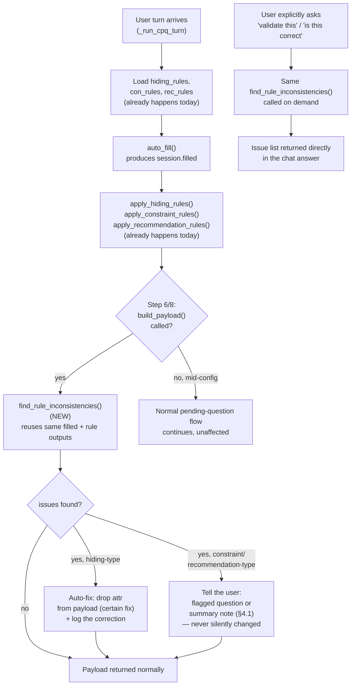

# CPQ Rule-Consistency Validation Plan

New, separate plan — companion to `docs/CPQ_RULE_TRACED_SUMMARY_PLAN.md`
(section-scoped summary + per-attr provenance) but scoped narrower and
implementable independently: a programmatic rule-consistency check inside
Aryx itself, plus the one concrete bug this session's manual version of
that check already found.

## 0. Verification flow diagram

How `find_rule_inconsistencies()` sits inside the existing turn flow — it
never runs standalone against nothing; it always runs against the SAME
`filled`/`attrs`/rule lists a turn already loaded, right after `auto_fill`
and the `apply_*` calls, before the answer is returned:



**Two entry points, one shared function** — matches §4's design exactly:
the automatic path (every payload build, silent unless it finds something)
and the on-demand path (explicit user request, always shows the result).
Neither path re-derives rule logic; both call the exact `apply_hiding_rules`/
`apply_constraint_rules`/`apply_recommendation_rules` methods the turn
already ran moments earlier — this is why it's a genuine cross-check
(comparing two already-independently-computed things) and not a
tautological self-check (§1's rejected design).

**How you'd use it, concretely**:
- **Passive/automatic**: nothing to do — every completed quote gets checked
  silently; if `includeAccidentalDamageAddDMSCoverage_astro`-style bugs
  exist, they show up in the cpq log the moment that payload is built,
  long before a customer notices a wrong BOM line.
- **Active/on-demand**: type something like *"validate this payload"* or
  *"is this correct?"* mid- or post-configuration — same function, same
  data, returned as a direct, readable answer instead of a log line.

## 1. Why not a self-check (rejected design, kept here for the record)

First proposal was a `validate_payload()` that re-checks "does this attr
exist" and "is this value a real option" against `attr_by_vn`/`options` —
correctly rejected: those are the SAME lookup tables `auto_fill`/
`build_payload` already used to produce the value. A check against its own
source data is tautological — it will always pass, by construction. Only
useful as a defensive assert against a future coding bug that bypasses the
normal fill path (e.g. a test injecting a raw dict), not as real validation.

## 2. What actually has teeth: cross-checking two independently-computed outputs

`auto_fill` (fills `session.filled`) and `apply_hiding_rules` (computes
`hidden_vns`) are two SEPARATE code paths in `evaluate_rules_loop` — nothing
today cross-checks that their results agree. A rule-consistency check is:
*for every attr present in `filled`, does an active hiding rule targeting it
currently evaluate true?* If yes, that attr should have been hidden/excluded
— its presence is a genuine bug, not a self-referential check.

This is exactly the method that found the real bug below — manually, this
session. The plan is to make it automatic and run on every turn (see §3.2).

## 3. The concrete bug this check already found

**Root cause, confirmed in `engine.py`**: `apply_hiding_rules`'s single-
condition fallback path does a bare string-equality check:

```python
# engine.py:1753 (current, buggy)
if current_val.lower() != rule.condition_value.lower():
    continue
```

But some hiding rules' `condition_value` is a tilde-delimited OR-list — e.g.
*"Hide Include Accidental Damage for certain Service Type"*:
`condition_attr=serviceTypeAdditionalDMSCoverage_astro`,
`condition_value="PREMIER~ADVANCED SOFTWARE ONLY~ESSENTIAL SOFTWARE ONLY"`,
target=`includeAccidentalDamageAddDMSCoverage_astro`. The literal string
`"premier"` will never equal the literal string
`"premier~advanced software only~essential software only"` — so this rule
(and every other single-row tilde-delimited hiding rule in the catalog, not
just this one) can **never fire**, regardless of which of its listed values
is actually selected.

**This convention is already handled correctly elsewhere in the same
file** — `engine.py:1908` splits constraint-rule `allowed_values` on `"~"`.
The hiding-rule single-condition path just never got the same treatment.

**Fix**: split `rule.condition_value` on `"~"`, check membership:

```python
else:
    current_val = filled_by_rule_id.get(rule.condition_attr_id)
    if current_val is None:
        continue
    allowed_vals = {v.strip().lower() for v in rule.condition_value.split("~") if v.strip()}
    if current_val.lower() not in allowed_vals:
        continue
```

Low risk — matches an established pattern already proven safe in this same
file; only changes behavior for condition_values that actually contain
`"~"` (single-value conditions are unaffected, since a 1-element split set
behaves identically to the old direct comparison).

## 4. Making the check automatic — ALL THREE rule types, not just hiding

The single manual find (§3) was a hiding-rule bug, but the SAME class of
bug — a fired rule and the actual filled value disagreeing — can happen for
constraint and recommendation rules too, declarative or script. All three
already have their own apply-methods in `engine.py` (`apply_hiding_rules`,
`apply_constraint_rules` at line 2139, `apply_recommendation_rules` at line
2025) — the consistency check reuses all three, not just one:

```python
def find_rule_inconsistencies(
    self, filled: dict[str, str], attrs: list[ConfigAttr],
    hiding_rules: list[HidingRule], con_rules: list[ConstraintRule],
    rec_rules: list[RecommendationRule], bml_eval: BmlEvaluator | None,
) -> list[dict]:
    """Cross-check auto_fill's output against each rule type's OWN
    independently-computed result — not a self-referential re-derivation.

    Covers all three rule categories, declarative AND script-backed
    (both already unified into one evaluation path per rule type since
    this session's earlier bml.py/engine.py fixes — no separate script
    handling needed here, it's already inside each apply_* method):

      - Hiding:          filled attr whose hiding rule currently matches
                         (§3's bug — general case, not this one instance).
      - Constraint:      filled value that is NOT in the active allowed_values
                         set for that attr (a stale/pre-cascade value that
                         should have been cleared but wasn't).
      - Recommendation:  attr not filled via "user" source, whose governing
                         recommendation rule's condition IS satisfied, but
                         the filled value does NOT match recommended_value
                         (the Bug 3c class — "invalidated: re-evaluating"
                         claimed but nothing actually changed).

    BML-script coverage — already handled, not a gap: confirmed all 3
    reused methods already resolve BOTH script forms internally via
    bml_eval — `rule.script` (the whole hide/allowed-set/recommend outcome
    is script-computed: engine.py:1732/2060/2174) and `rule.condition_script`
    (a declarative action gated by a script boolean: engine.py:2067/2181).
    find_rule_inconsistencies() never re-implements script evaluation
    itself — it calls the SAME apply_* methods already used to build the
    payload, so a script-backed rule flows through exactly like a
    declarative one, automatically, with zero new script-handling code.

    Script-gated rules that return "unknown" (bml_eval can't resolve them —
    e.g. an idiom not yet covered by Tier 1/1.5, per
    docs/CPQ_LAYOUT_VISIBILITY_FLOW_PLAN.md §6) are skipped, not flagged —
    same "never guess" discipline as the rest of this session's fixes; an
    unresolvable script is a coverage gap, not evidence of a bug.
    """
    issues: list[dict] = []

    _visible, _msgs, hidden_vns = self.apply_hiding_rules(attrs, filled, hiding_rules, bml_eval)
    for vn in hidden_vns:
        if filled.get(vn):
            issues.append({"attr": vn, "value": filled[vn], "rule_type": "hiding",
                            "issue": "filled but an active hiding rule matches"})

    constrained_opts = self.apply_constraint_rules(attrs, filled, con_rules, bml_eval)
    by_vn = {a.variable_name: a for a in attrs}
    for vn, value in filled.items():
        attr = by_vn.get(vn)
        allowed = constrained_opts.get(attr.entity_id) if attr else None
        if allowed is not None and value not in allowed:
            issues.append({"attr": vn, "value": value, "rule_type": "constraint",
                            "issue": f"value not in active allowed set {allowed}"})

    for rule in rec_rules:
        target = by_vn.get(_resolve_by_rule_id(rule.target_attr_id, attrs))
        if not target or target.variable_name not in filled:
            continue
        vn = target.variable_name
        if self._filled_source.get(vn) == "user":
            continue  # explicit user answer always wins, not a bug
        condition_met = ...  # same declarative/script check apply_recommendation_rules already does
        if condition_met and filled[vn] != rule.recommended_value:
            issues.append({"attr": vn, "value": filled[vn], "rule_type": "recommendation",
                            "issue": f"condition met but value != recommended '{rule.recommended_value}'"})

    return issues
```

(Recommendation-check pseudocode above intentionally reuses whatever
condition-matching `apply_recommendation_rules` already does internally —
implementation should factor that matching logic into a shared helper both
methods call, not duplicate it.)

Called at 2 points:
- **On every `build_payload` call** (Step 6/8, including regeneration after
  a user-driven change — confirmed live this session that regeneration
  already re-runs the full rule-evaluation pass every time, so this needs
  no separate "re-validate after rebuild" trigger, it rides the existing
  loop).
- **On demand** via a `validate` intent in `ask_api.py`, returning the
  inconsistency list directly to the user for audit purposes.

### 4.1 When an issue is found: auto-fix vs. tell the user — per rule type, not one blanket rule

Not every issue type is safe to silently correct. The right response
differs by rule type, based on how confident the engine can be about what
the CORRECT value should have been:

- **Hiding-type issues → auto-fix (drop from payload).** If a hiding rule
  currently matches, the engine knows with certainty this attr should never
  have been in the payload at all — its value was never a real customer
  decision. `build_payload` should filter it out before returning, the same
  way `apply_hiding_rules` already filters it out of the pending/asked flow
  today — this closes the actual gap (hiding and payload-building currently
  don't share this filter) rather than just reporting it. Still logged, so
  the fix itself is auditable.
- **Constraint-type issues → tell the user, do not auto-fix.** A stale
  value outside the current allowed set has no single obviously-correct
  replacement — silently picking one of the allowed values risks
  contradicting a real earlier customer choice. Surface it as a flagged
  question ("X's value is no longer valid given Y — please reselect") the
  same way a cascade-invalidated attr already re-enters `pending` today.
- **Recommendation-type issues → tell the user, do not auto-fix.** The
  filled value might be a legitimate, intentional override that happens to
  differ from the rule's suggestion (recommendations are advisory, not
  mandatory) — auto-overwriting it could destroy a real customer choice.
  Surface it as an informational note in the completion summary (the
  Bug-3c-style "this attr's recommendation doesn't match its value" case),
  not a silent change.

Net: only the hiding case is safe to silently fix, because it's the only
one where the engine is CERTAIN the current value is wrong. The other two
report and let the human decide — matching this whole session's "never
guess" discipline (D2), just applied one level up, to fixing rather than
just filling.

## 5. Integration with `docs/CPQ_RULE_TRACED_SUMMARY_PLAN.md`

**Two separate plan files, cross-referenced, not merged.** They stay
distinct documents (different scope: that one is the section-scoped
summary + provenance display; this one is the correctness cross-check) but
share one underlying data need, so they should be BUILT together, not
independently:

- That plan's per-attr provenance trace (its §4) already needs to know,
  per attr, "did its governing hiding/constraint/recommendation rule fire"
  — exactly what `find_rule_inconsistencies()` (this plan's §4) computes.
- The `consistency_flag` this plan proposes is a natural extra field on
  that plan's provenance trace object, not a separate structure.
- §4.1's fix-vs-tell decision above IS the answer to that plan's own open
  question of "why is this attribute shown, is it correct" — the traced
  summary shows the reasoning, this plan's check is what confirms the
  reasoning is actually consistent.

Reference this doc from that plan's §4 (and vice versa) once both are
implemented — no content needs to be copy-pasted between them.

## 6. Implementation order

1. Fix `engine.py:1753` (§3) — smallest, immediately fixes a real live
   hiding-rule bug.
2. Add `find_rule_inconsistencies()` covering all 3 rule types (§4) — new
   method, no existing call sites change. Factor the recommendation-
   condition-matching logic out of `apply_recommendation_rules` into a
   shared helper first, so the check doesn't duplicate it (§4 note).
3. Wire it into `build_payload`'s call sites in `ask_api.py` as a logged
   side-channel (§4).
4. Only after 1-3 land: extend the Rule-Traced Summary plan's provenance
   object to include `consistency_flag` (§5) — depends on 2 existing.

## 7. Verification plan

After step 1: re-run the exact live query from this session ("Quote APX
Next Enhanced radios...", `serviceTypeAdditionalDMSCoverage_astro=PREMIER`)
and confirm `includeAccidentalDamageAddDMSCoverage_astro` no longer appears
in the payload — this alone confirms the hiding-rule fix.

After step 2-3, three separate confirmations, one per rule type:
- **Hiding**: `find_rule_inconsistencies()` returns empty for the now-
  corrected payload above (agrees with itself once the rule actually fires).
- **Constraint**: construct a case where a filled value predates an active
  constraint narrowing (the same class of bug `auto_fill`'s own re-
  validation-on-cascade logic already guards against for NEW fills —
  confirm the check catches a value that slipped through some other path).
- **Recommendation**: re-run the "change hardware version" transcript from
  earlier this session (`productSelectionProduct_all` claimed "invalidated
  — re-evaluating" but never changed) — confirm the check now flags this
  exact case as a recommendation-type inconsistency, since that's the
  concrete real-world instance that motivated adding this rule type to the
  check at all.
