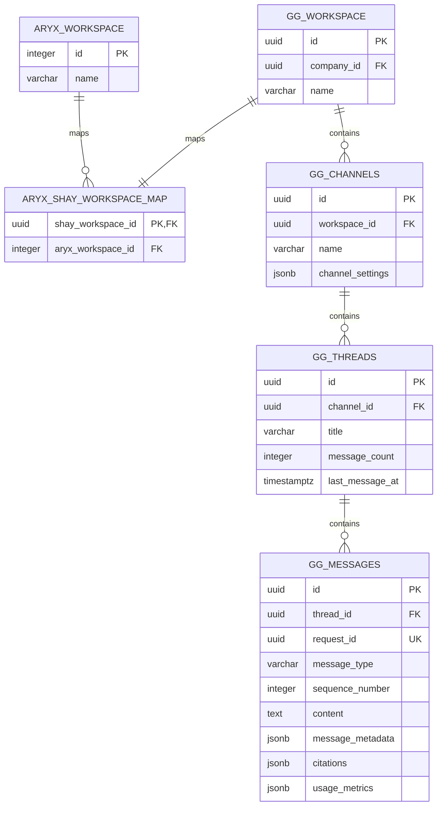

# Aryx Ask Shay Message ERD

```mermaid
erDiagram
    ARYX_WORKSPACE {
        integer id PK
        varchar name
    }
    ARYX_SHAY_WORKSPACE_MAP {
        uuid shay_workspace_id PK,FK
        integer aryx_workspace_id FK
    }
    GG_WORKSPACE {
        uuid id PK
        uuid company_id FK
        varchar name
    }
    GG_CHANNELS {
        uuid id PK
        uuid workspace_id FK
        varchar name
        jsonb channel_settings
    }
    GG_THREADS {
        uuid id PK
        uuid channel_id FK
        varchar title
        integer message_count
        timestamptz last_message_at
    }
    GG_MESSAGES {
        uuid id PK
        uuid thread_id FK
        uuid request_id UK
        varchar message_type
        integer sequence_number
        text content
        jsonb message_metadata
        jsonb citations
        jsonb usage_metrics
    }

    ARYX_WORKSPACE ||--o{ ARYX_SHAY_WORKSPACE_MAP : maps
    GG_WORKSPACE ||--|| ARYX_SHAY_WORKSPACE_MAP : maps
    GG_WORKSPACE ||--o{ GG_CHANNELS : contains
    GG_CHANNELS ||--o{ GG_THREADS : contains
    GG_THREADS ||--o{ GG_MESSAGES : contains
```
